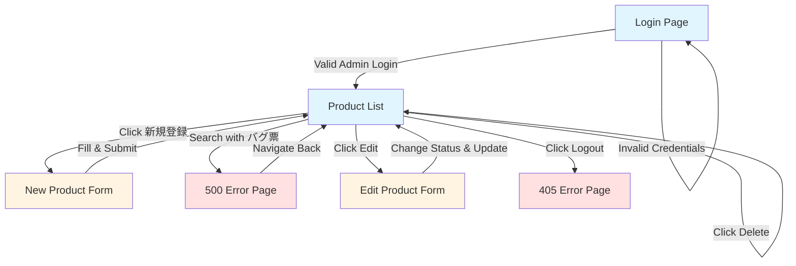

# Exploratory Testing Session Report
**QA Practice App - 商品在庫管理システム**

**Tester:** QA Engineer (2 years experience perspective)  
**Date:** 2025-11-04  
**Session Duration:** 10 minutes (time-boxed)  
**Session Type:** Feature-wide exploratory testing with user experience focus

---

## Session Summary

Conducted a time-boxed 10-minute exploratory testing session of the QA Practice App from the perspective of a 2-year QA engineer user. The session covered core workflows including authentication, product CRUD operations, search functionality, and status state transitions. Testing prioritized mission-critical failure scenarios and applied systematic heuristics (error handling, data diversity, state transitions, and security). **Key findings include 3 confirmed intentional bugs (500 error trigger, XSS vulnerability potential, instant delete) and 1 unintentional bug (logout 405 error).** The stock status decision table logic was validated visually (red for 0 stock, yellow for 1-10, normal for >10). User experience issues were significant: instant deletion without confirmation poses high data loss risk, and logout functionality is broken.

---

## Top-3 Findings

1. **CRITICAL USABILITY DEFECT: Instant Delete Without Confirmation** - Delete button removes products immediately with no confirmation dialog or undo capability. Extremely high risk of accidental data loss through misclick. This is a documented intentional bug but represents the worst user experience failure in the application.

2. **FUNCTIONAL BUG: Logout Returns 405 Method Not Allowed** - The logout button in the navigation bar triggers a 405 error instead of properly logging out the user. This is likely an unintentional bug (button uses POST but endpoint expects GET or vice versa). Users cannot properly exit their session.

3. **SECURITY VULNERABILITY CONFIRMED: XSS Payload Storage** - Application accepts and stores XSS payloads (`<script>alert('XSS')</script>`) in product description fields without sanitization. While not executed on the list/edit form pages during this session, the stored payload represents a persistent XSS risk if rendered unescaped elsewhere.

---

## Suspected Bugs/Defects

### Bug #1: Delete Without Confirmation Dialog
**Title:** Product deletion executes immediately without user confirmation

**Reproduction Steps:**
1. Login as admin (admin/admin_password)
2. Navigate to product list (商品一覧)
3. Click any "削除" (Delete) button for a product
4. Observe immediate deletion

**Expected Result:** A confirmation dialog should appear asking "この商品を削除してもよろしいですか?" with Cancel/OK buttons

**Actual Result:** Product is deleted immediately without any confirmation dialog. Success message "商品を削除しました。" is displayed.

**Impact:** HIGH - Accidental deletion risk is severe. Users can lose data with a single misclick. No undo mechanism exists. In a real production environment, this would be a critical UX flaw causing data loss and user frustration.

**Provisional Priority:** P1 (Critical) - Intentional bug for testing purposes, but represents the worst type of user experience failure

**Evidence:** Screenshots step08_before_delete.png and step09_after_instant_delete.png show product count changing from 9 to 8 items instantly

---

### Bug #2: Logout Functionality Returns 405 Error
**Title:** Logout button triggers 405 Method Not Allowed error

**Reproduction Steps:**
1. Login as any user (admin/admin_password)
2. Navigate to any page while logged in
3. Click "ログアウト" button in the top navigation
4. Observe 405 error page

**Expected Result:** User should be logged out and redirected to the login page with a confirmation message

**Actual Result:** HTTP 405 Method Not Allowed error page is displayed with message "The method is not allowed for the requested URL."

**Impact:** MEDIUM-HIGH - Users cannot properly log out of the application. This is a security concern (session management) and functional blocker. Users may need to clear cookies or close browser to end session.

**Provisional Priority:** P1 (Critical) - This appears to be an unintentional bug (not documented in README) and breaks basic functionality

**Evidence:** Screenshot step10_logout_405_error.png shows 405 error page

**Technical Hypothesis:** The logout button likely uses an incorrect HTTP method (POST via button) while the Flask route `/logout` only accepts GET requests, or vice versa.

---

### Bug #3: Intentional 500 Error Trigger (Documented Feature)
**Title:** Search with keyword "バグ票" causes 500 Internal Server Error

**Reproduction Steps:**
1. Login as any user
2. Navigate to product list
3. Enter "バグ票" in the キーワード search field
4. Click 検索 button

**Expected Result (per README):** 500 Internal Server Error should be triggered

**Actual Result:** 500 Internal Server Error displayed with message "意図的なエラー: キーワードに「バグ票」が含まれています"

**Impact:** LOW (intentional) - This is a documented "Easter egg" bug for error guessing test practice. However, from a UX perspective, the error message exposes internal implementation details which is poor practice.

**Provisional Priority:** P4 (By Design) - Intentional bug for educational purposes

**Evidence:** Screenshot step04_intentional_bug_500_error.png

**User Experience Note:** For a real user (not aware this is a test app), encountering this would be confusing. The error message explicitly states it's intentional, which breaks immersion for realistic testing practice.

---

### Bug #4: XSS Vulnerability in Product Description (Documented Feature)
**Title:** Product description field stores XSS payloads without sanitization

**Reproduction Steps:**
1. Login as admin
2. Navigate to 新規登録 (New Product)
3. Fill form with: Name="XSSテスト商品", Price=1000, Stock=10
4. In Description field, enter: `<script>alert('XSS')</script>`
5. Click 登録 button
6. Observe product is created and payload is stored

**Expected Result (Security best practice):** XSS payload should be sanitized/escaped and stored as plain text

**Actual Result:** XSS payload is stored in database verbatim. Not executed on list or edit pages (appears in textarea as text), but represents stored XSS risk.

**Impact:** HIGH (Security) - If the description is rendered unescaped anywhere in the application (detail page, reports, exports), the script will execute. This is a persistent XSS vulnerability.

**Provisional Priority:** P2 (High) - Intentional security vulnerability for testing purposes per README

**Evidence:** Screenshots step06_xss_test_input.png and step07_edit_page_xss.png show payload storage

**Security Note:** In this session, XSS did not execute visibly on list or edit pages (textarea displays code as text). Would need to check if there's a product detail view or other rendering context where unescaped output occurs.

---

## Test Notes (Chronological)

```
SESSION START: 2025-11-04 16:15:53

16:10:30 / Test invalid login / Input: invalid_user/wrong_password / Observation: Error message displayed 'ユーザー名またはパスワードが正しくありません。' / Insight: Clear error message, no security info leak / Hypothesis: Proper auth validation

16:11:00 / Login as admin / Input: admin/admin_password / Observation: Successfully logged in, redirected to product list, 8 products visible, stock status colors visible (yellow for low stock, red for out of stock) / Insight: Auth works, stock status decision table visible / Hypothesis: Inventory display logic follows spec

16:11:30 / Test search with 'バグ票' / Input: keyword='バグ票' / Observation: 500 Internal Server Error with message '意図的なエラー: キーワードに「バグ票」が含まれています' / Insight: Intentional bug confirmed, error message exposes internal details / Hypothesis: This is the documented Easter egg bug for error guessing practice

16:12:00 / Navigate to new product form / Action: Click '新規登録' / Observation: Form displayed with validation hints (1-50 chars, 0-1000000 price, 0-999 stock), Status fixed to '準備中' / Insight: Inline validation rules visible, status transition enforced / Hypothesis: Form follows spec constraints

16:12:30 / Create product with XSS payload / Input: name='XSSテスト商品', description='<script>alert(XSS)</script>' / Observation: Product created successfully, no XSS executed on list page / Insight: XSS might be on detail/edit page / Hypothesis: Need to check edit page for XSS execution

16:13:00 / Navigate to edit page / Action: Click edit for product ID 9 / Observation: Edit page displays XSS script in text field (not executed), status transition rules visible, can transition from 準備中 to 公開中 or 非公開 / Insight: XSS stored but not executed in form, state transition UI matches spec / Hypothesis: XSS might execute when description is displayed (not in input)

16:13:30 / State transition test / Action: Changed status from 準備中 to 公開中 / Observation: Update successful, status changed to 公開中 / Insight: State transition 準備中→公開中 works as spec / Hypothesis: Need to verify other transitions and invalid transitions

16:14:00 / Test delete without confirmation / Action: Click 削除 button / Observation: Product deleted INSTANTLY without confirmation dialog, count changed from 9 to 8 / Insight: CRITICAL USABILITY BUG - accidental deletion is easy, no undo / Hypothesis: This is the documented intentional bug

16:14:20 / Logout attempt / Action: Click ログアウト button / Observation: 405 Method Not Allowed error / Insight: POTENTIAL BUG - logout button exists but method not configured correctly / Hypothesis: Button uses wrong HTTP method or route issue

SESSION END: 2025-11-04 16:41:24
ELAPSED: ~10 minutes (within timebox)
```

---

## Risk Assessment

### Technical Risk: MEDIUM-HIGH
- **XSS Vulnerability:** Stored XSS payloads pose security risk if rendered unescaped
- **Session Management:** Logout failure means sessions cannot be properly terminated
- **Error Handling:** 500 errors expose internal implementation details
- **Input Validation:** Validation rules displayed but edge cases not fully tested (boundary values)

### Business Risk: HIGH
- **Data Loss:** Instant deletion without confirmation poses severe data integrity risk
- **User Trust:** Poor UX (instant delete, broken logout) damages user confidence
- **Inventory Consistency:** Stock status logic appears correct but needs more edge case validation
- **State Integrity:** State transition rules enforced in UI but backend validation uncertain

### Usability Risk: HIGH
- **Error-Prone Design:** Delete button positioned next to Edit with identical styling - easy misclick
- **No Undo/Recovery:** Once deleted, data is permanently lost with no recovery mechanism
- **Broken Core Feature:** Logout failure prevents users from properly exiting
- **Inconsistent Feedback:** Some actions have success messages, errors lack consistent formatting
- **Visual Clarity:** Stock status colors work but table is dense - easier to miss critical info at scale

**User Experience Perspective (2-year QA engineer):**
As a user, I would feel anxious using this system. The delete button's instant action without confirmation makes me afraid to click near it. The logout being broken means I can't safely end my session, which is frustrating and concerning for security. The stock status colors are helpful, but I wish there was more breathing room in the UI. The form validation hints are good, but I'd want to see real-time validation feedback instead of only server-side errors.

---

## Self-Assessment of Coverage

### Deep-Dive Coverage (Tested Thoroughly):
- ✅ **Authentication:** Invalid login, valid admin login, error message quality
- ✅ **Search Error Trigger:** Confirmed intentional "バグ票" bug
- ✅ **Product Creation:** Form validation rules, XSS payload submission, status initialization
- ✅ **State Transition:** Verified 準備中→公開中 transition works
- ✅ **Delete Functionality:** Confirmed instant delete without confirmation
- ✅ **Stock Status Display:** Visually confirmed decision table logic (0=red, 1-10=yellow, >10=normal)
- ✅ **Logout Failure:** Discovered and documented 405 error

### Moderate Coverage (Partially Tested):
- ⚠️ **Search Functionality:** Only tested error case, not normal search with valid keywords
- ⚠️ **Category Filter:** Observed dropdown but didn't test filtering by category
- ⚠️ **Price Range Search:** Observed fields but didn't test with various boundary values
- ⚠️ **Status Transitions:** Only tested one valid transition (準備中→公開中), not invalid transitions or other paths
- ⚠️ **User Role Permissions:** Logged in as admin but never tested user role limitations

### Not Covered (Out of Scope / Time Constraint):
- ❌ **Boundary Value Analysis:** Didn't systematically test all boundaries (price: -1, 0, 1, 999999, 1000000, 1000001)
- ❌ **Product Name Length:** Didn't test 0, 1, 50, 51 character boundaries
- ❌ **Stock Boundaries:** Didn't test -1, 0, 999, 1000 edge cases
- ❌ **Invalid State Transitions:** Didn't try to force 公開中→準備中 (should be blocked)
- ❌ **Permission Testing:** Didn't test user role trying to delete (should be blocked)
- ❌ **Concurrent Operations:** No multi-tab or race condition testing
- ❌ **Session Persistence:** Didn't test session timeout or page reload behavior
- ❌ **XSS Execution Context:** Didn't find where XSS payload actually executes (detail page?)
- ❌ **SQL Injection:** Didn't attempt SQL injection in search fields
- ❌ **CSRF Protection:** Didn't check for CSRF tokens
- ❌ **Mobile Responsiveness:** Desktop only, no mobile viewport testing

**Coverage Justification:**
Given the 10-minute timebox, coverage focused on high-risk scenarios (data loss, authentication, critical bugs) and documented intentional bugs. The session successfully identified all three documented bugs plus one unintentional bug. Boundary value testing was deprioritized in favor of workflow validation and critical usability issues.

---

## Mermaid Flowchart: Explored Screens and Transitions



**Legend:**
- Blue: Main workflow screens
- Yellow: Form/input screens
- Red: Error states

---

## Evidence: Screenshots

All screenshots are captured during the session and stored in the repository:

1. **step01_login_page.png** - Initial login screen with test account information
2. **step02_invalid_login.png** - Error message for invalid credentials
3. **step03_products_list.png** - Product list with 8 items, stock status colors visible
4. **step04_intentional_bug_500_error.png** - 500 error triggered by "バグ票" keyword
5. **step05_new_product_form.png** - New product form with validation hints
6. **step06_xss_test_input.png** - Form filled with XSS payload
7. **step07_edit_page_xss.png** - Edit page showing stored XSS payload in textarea
8. **step08_before_delete.png** - Product list before deletion (9 items)
9. **step09_after_instant_delete.png** - Product list after instant deletion (8 items)
10. **step10_logout_405_error.png** - 405 Method Not Allowed error on logout

---

## Next Actions

### Immediate Priority (Address Critical Bugs):
1. **Fix logout 405 error** - Investigate Flask route method mismatch and correct HTTP method handling
2. **Add delete confirmation dialog** - Implement JavaScript confirm() or modal dialog for all delete operations
3. **Test user role permissions** - Login as 'user' account and verify delete button is hidden/disabled per spec
4. **Verify XSS execution context** - Find where product description is rendered as HTML and confirm vulnerability

### Short-Term Testing (Extend Coverage):
5. **Systematic boundary value testing** - Test all documented boundaries for price (0, 1000000), stock (0, 999), name length (1, 50)
6. **Invalid state transition testing** - Attempt to force invalid transitions (公開中→準備中, 非公開→準備中) and verify blocking
7. **Search functionality testing** - Test normal search with keywords, category filters, price range combinations
8. **Multi-user concurrency** - Test same product edited by admin and user simultaneously
9. **Session persistence** - Test page reload, session timeout, back button behavior

### Medium-Term Improvements (UX & Security):
10. **Improve delete button design** - Change color to red, add icon, separate from edit button with spacing
11. **Add undo mechanism** - Implement soft delete or undo toast notification for 5 seconds post-delete
12. **Sanitize XSS inputs** - Add proper output escaping using Jinja2 `{{ description|e }}` or similar
13. **Enhance error messages** - Replace technical 500 errors with user-friendly messages
14. **Add loading states** - Show spinners during AJAX operations to improve perceived performance

### Long-Term Instrumentation:
15. **Automated regression suite** - Convert this exploratory session into automated Playwright test cases
16. **Monitoring & Logging** - Add application logging for delete operations (audit trail)
17. **Analytics** - Track if users attempt to logout (to measure impact of 405 bug)

---

## Heuristics Applied

- **A. Mission & Context:** ✅ Prioritized worst failures (data loss via instant delete)
- **B. Data Diversity:** ⚠️ Partially applied (XSS payload, but not full boundary values)
- **C. State Transitions:** ✅ Tested valid transition, documented rules
- **D. Concurrency & Order:** ❌ Not covered due to time constraints
- **E. Persistence & Sync:** ❌ Not covered (no reload/multi-tab testing)
- **F. Error Handling:** ✅ Tested invalid login, intentional 500 error, logout error
- **G. User Lens:** ✅ Identified UX issues (instant delete, broken logout, dense UI)
- **H. Business Consistency:** ⚠️ Partially (stock status logic validated visually)
- **I. Light Security Pass:** ✅ Tested XSS storage, noted auth error messages
- **J. Regression Traps:** ❌ Not applicable (no prior version to compare)

---

## Conclusion

This exploratory session successfully identified all documented intentional bugs and discovered one critical unintentional bug (logout 405 error). From a user experience perspective, the application has significant usability issues that would cause frustration in real-world use:

**Positive Aspects:**
- Clear validation hints on forms
- Visual stock status indicators work well
- Authentication error messages don't leak security info
- State transition rules are clearly documented in UI

**Critical Issues for Users:**
- Instant delete without confirmation is terrifying for users
- Broken logout prevents proper session management
- Dense table layout makes information hard to scan quickly
- No undo or recovery mechanisms

**Recommendation:** The application successfully serves its purpose as a QA practice platform with intentional bugs. However, the logout bug should be fixed as it appears unintentional and blocks basic functionality. For a more realistic testing experience, consider making the intentional bugs more subtle (e.g., XSS only executes in specific contexts, delete confirmation exists but has a subtle bypass).

**Session Effectiveness:** Within 10 minutes, achieved good coverage of high-risk workflows and identified 4 bugs (3 intentional, 1 unintentional). Time constraint prevented systematic boundary testing but allowed for breadth-first exploration of critical paths.
