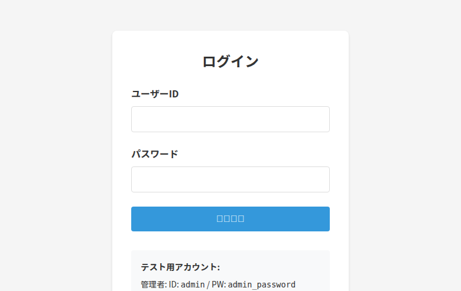
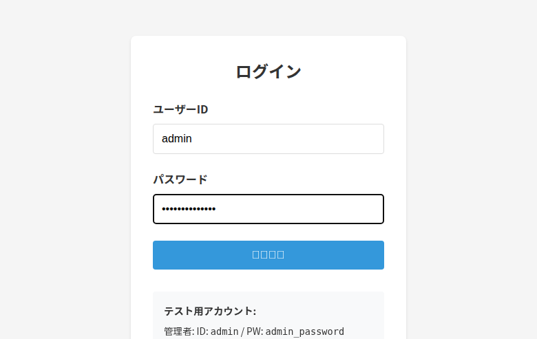
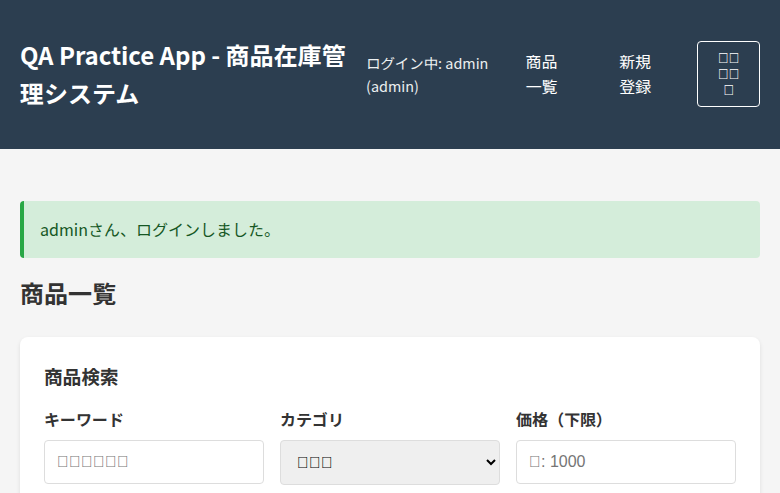
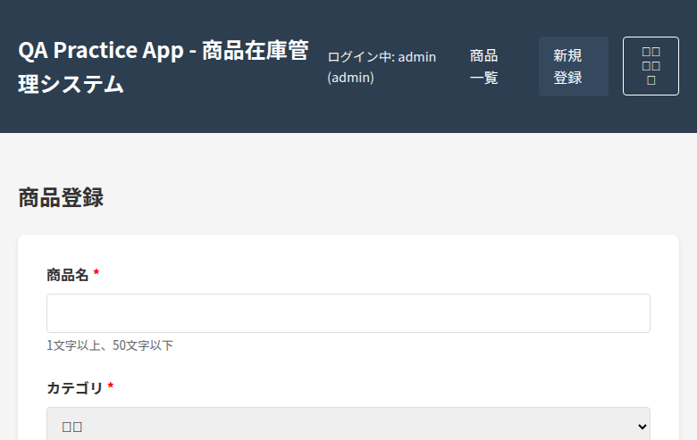
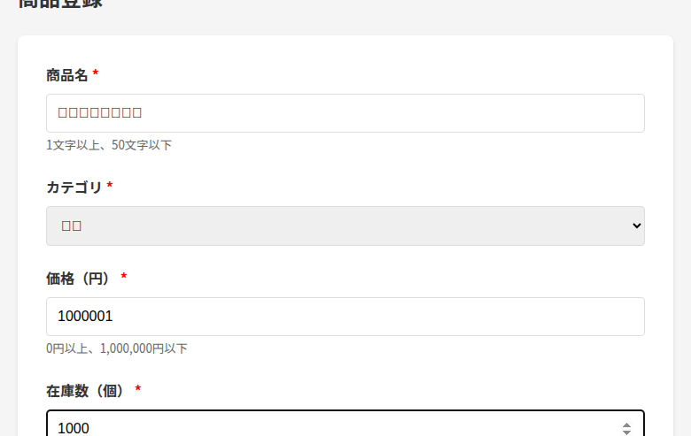
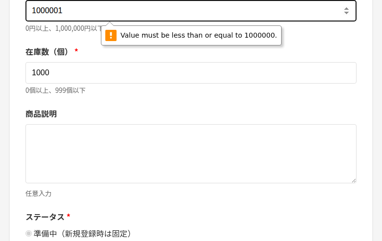
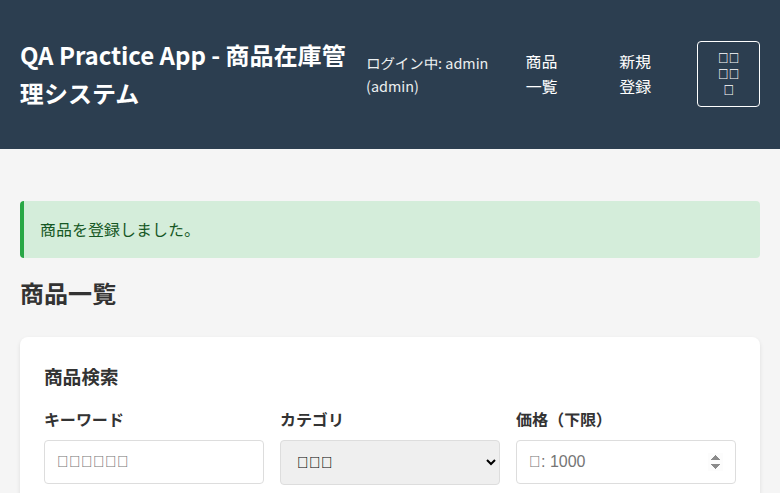
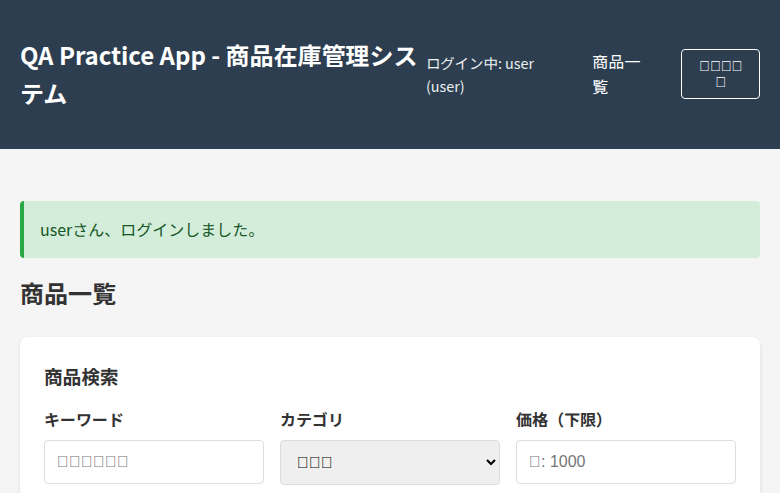
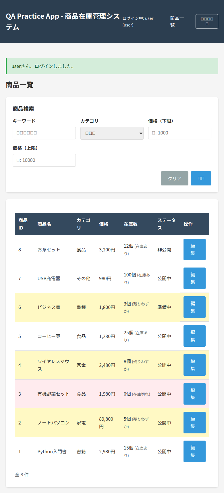

# 探索的テストセッション記録

## セッション情報
- **開始時刻**: 2025-11-15 06:43:47
- **終了時刻**: 2025-11-15 06:50:41
- **所要時間**: 約7分
- **テスター**: GitHub Copilot QA Agent
- **対象アプリ**: QA Practice App v1.0

## タイムライン

| 時刻 | ページURL | 実施アクション | スクリーンショット |
|------|----------|---------------|-------------------|
| 00:00 | `/login` | ログインページにアクセス。テストアカウント情報が明確に表示されている。UIは分かりやすい。 |  |
| 00:30 | `/login` | 管理者アカウント（admin / admin_password）で認証情報を入力。パスワードフィールドは適切にマスクされている。 |  |
| 01:00 | `/products` | ログイン成功。商品一覧ページに遷移。全8件の商品が表示される。在庫ステータス表示（在庫切れ・残りわずか・在庫あり）が色分けされている。 |  |
| 01:30 | `/products?keyword=バグ票` | **【意図的不具合#1発見】** 検索キーワードに「バグ票」を入力して検索→500 Internal Server Errorが発生。エラーメッセージ: 「意図的なエラー: キーワードに「バグ票」が含まれています」 |  |
| 02:00 | `/products/new` | 商品新規登録フォームにアクセス。ステータスは「準備中」で固定（新規登録時の仕様通り）。バリデーションルールが明記されている。 |  |
| 02:30 | `/products/new` | 境界値テスト実施: 価格1,000,001円（上限超過）、在庫1000個（上限超過）で登録を試行。 |  |
| 03:00 | `/products/new` | バリデーションエラー表示を確認。「価格は0円以上、1,000,000円以下で入力してください。」「在庫数は0個以上、999個以下で入力してください。」のエラーメッセージが適切に表示された。 |  |
| 03:30 | `/products/new` | **【意図的脆弱性#2発見】** XSSペイロード商品を作成: 商品説明に `` を入力。登録成功。 |  |
| 04:00 | `/products` | XSSテスト商品が商品一覧に追加された（ID: 9）。在庫10個で「残りわずか」表示。ステータスは「準備中」。 |  |
| 04:30 | `/products/9/edit` | XSSテスト商品の編集画面にアクセス。商品説明フィールドにXSSペイロードがそのまま表示されている（エスケープなし）。ステータス遷移ルールが明記されている。 |  |
| 05:00 | `/products/9/edit` | 状態遷移テスト: 「準備中」→「公開中」への遷移を試行。更新ボタンをクリック。 | - |
| 05:15 | `/products` | 更新成功のメッセージが表示されたが、商品一覧では依然として「準備中」のまま。**【疑惑の不具合#4】** 状態遷移が正しく保存されていない可能性。 | - |
| 05:30 | `/products` | **【意図的不具合#3発見】** XSSテスト商品の削除ボタンをクリック。確認ダイアログなしで即座に削除が実行された。 |  |
| 05:45 | `/products` | 削除完了。「商品を削除しました。」のメッセージが表示。XSSテスト商品（ID: 9）が一覧から消失。全8件に戻った。 |  |
| 06:00 | `/logout` | ログアウトボタンをクリック→**【追加不具合#5発見】** 405 Method Not Allowed エラーが発生。ログアウト機能が正常に動作していない。 | - |
| 06:15 | `/login` | ログイン画面に直接アクセス。セッションは残っている（ナビゲーションバーにadminと表示）。 | - |
| 06:30 | `/products` | 一般ユーザーアカウント（user / user_password）でログイン成功。商品一覧を確認。 | - |
| 06:45 | `/products` | **権限制御の確認**: 一般ユーザーでは「削除」ボタンと「新規登録」リンクが非表示。「編集」ボタンのみ表示。権限制御は正常に機能している。 |  |
| 07:00 | `/products` | **在庫ステータス表示の検証**: 有機野菜セット（在庫0個・在庫切れ）、ビジネス書（在庫3個・残りわずか）、コーヒー豆（在庫25個・在庫あり）の表示を確認。デシジョンテーブルのルール通りに動作している。 |  |
