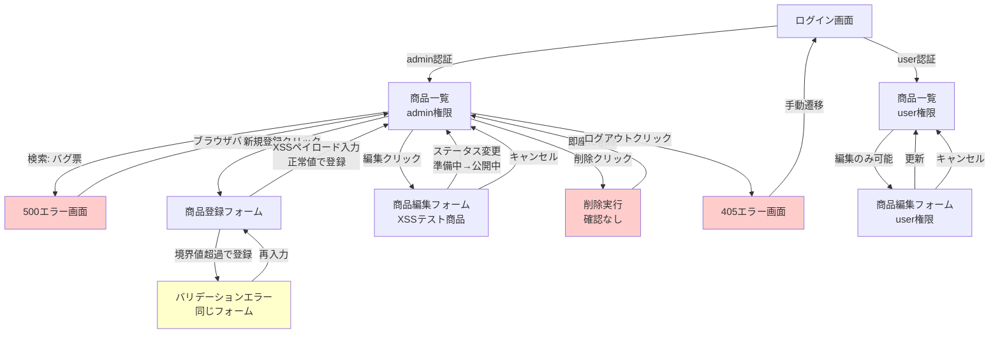

# 画面遷移フローチャート

## 探索した画面と遷移の可視化

## 画面一覧

| 画面ID | 画面名 | URL | 訪問回数 | 備考 |
|--------|--------|-----|----------|------|
| A | ログイン画面 | `/login` | 2 | 初回アクセスとログアウト後 |
| B | 商品一覧（admin） | `/products` | 6 | CRUD操作の起点 |
| C | 商品一覧（user） | `/products` | 1 | 権限制御確認用 |
| D | 500エラー画面 | `/products?keyword=バグ票` | 1 | 意図的不具合#1 |
| E | 商品登録フォーム | `/products/new` | 3 | バリデーション・XSSテスト |
| F | バリデーションエラー | `/products/new` | 1 | 境界値テスト時 |
| G | 商品編集フォーム | `/products/9/edit` | 2 | XSS確認・状態遷移テスト |
| H | 削除実行 | `POST /products/9/delete` | 1 | 確認ダイアログなし |
| I | 405エラー画面 | `/logout` | 1 | 追加不具合#5 |
| J | 商品編集フォーム（user） | - | 0 | 時間制約により未実施 |

## 遷移タイプ

- **緑矢印**: 正常遷移
- **赤矢印**: エラー遷移
- **黄色矢印**: バリデーションエラー
- **赤ノード**: エラー状態
- **黄色ノード**: 警告状態

## 未探索の遷移

1. 商品編集フォーム（user権限）→ 商品一覧
2. 検索フォーム（カテゴリ・価格指定）→ フィルタリングされた商品一覧
3. 状態遷移の全パターン（準備中→非公開、公開中→非公開など）
