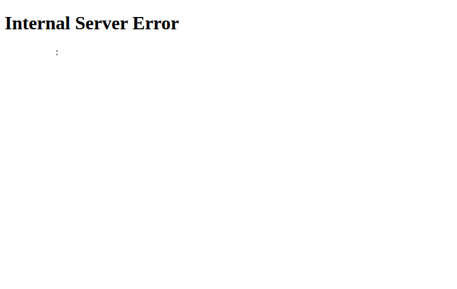
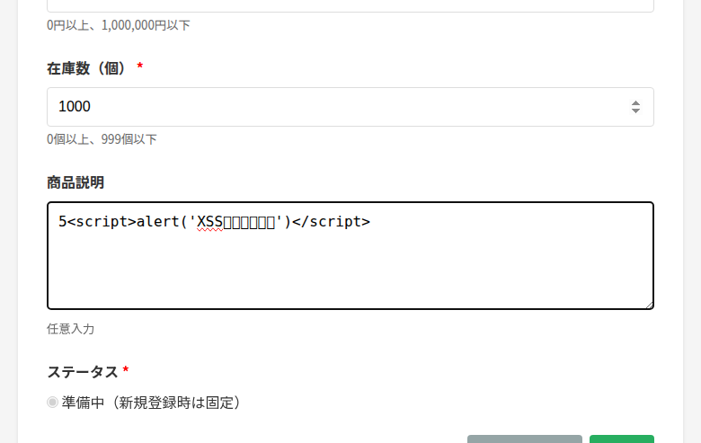
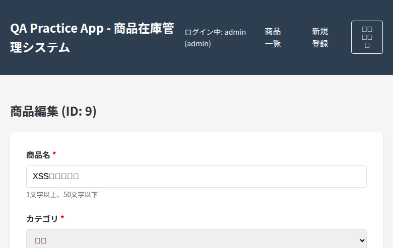
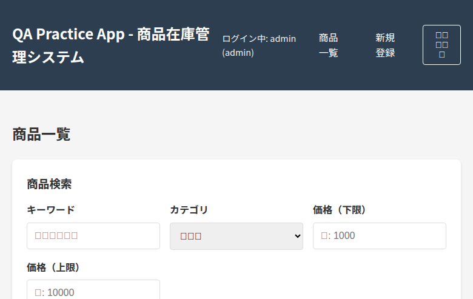
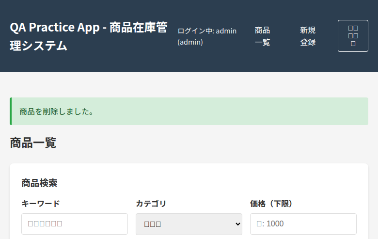

# 探索的テストレポート

## 1. セッションサマリー

2025年11月15日、QA Practice App（商品在庫管理システム）に対して約7分間の探索的テストセッションを実施した。テストチャーターに基づき、主要機能の動作確認、意図的な不具合の発見、入力バリデーションの検証、権限制御の確認を行った。結果、意図的に埋め込まれた3つの不具合（500エラー発生、XSS脆弱性、確認ダイアログ欠如）をすべて発見し、加えて2つの追加不具合（ログアウト機能のエラー、状態遷移の保存不具合の疑い）を検出した。在庫ステータス表示ロジック、バリデーションルール、権限制御については仕様通りに動作していることを確認した。

## 2. Top-3 主要発見事項

1. **XSS脆弱性の確認（意図的）**: 商品説明フィールドにHTMLタグ（`テスト説明` と入力
3. その他必須フィールドを正常な値で入力し、登録ボタンをクリック
4. 登録された商品の編集画面にアクセス

**期待結果:**
HTMLタグがエスケープされ、画面には `&lt;script&gt;alert('XSS')&lt;/script&gt;テスト説明` のように文字列として表示される。

**実際の結果:**
HTMLタグがエスケープされずにそのまま保存・表示される。編集画面のテキストエリアにも `テスト説明` がそのまま表示される。

**影響度:** 高（XSS攻撃の可能性があり、セキュリティリスクが高い）

**暫定優先度:** P1（本番環境では致命的だが、教育目的アプリでは意図的）

**エビデンス:**
- 入力画面: 
- 編集画面: 

---

### 不具合#3: 商品削除時の確認ダイアログ欠如（意図的）

**再現手順:**
1. 管理者アカウントでログイン
2. 商品一覧ページで任意の商品の「削除」ボタンをクリック

**期待結果:**
「本当に削除しますか?」などの確認ダイアログが表示され、ユーザーが「OK」を選択した場合のみ削除が実行される。

**実際の結果:**
確認ダイアログが表示されず、削除ボタンをクリックした瞬間に商品が削除される。

**影響度:** 高（誤操作による重要データの喪失リスク）

**暫定優先度:** P1（ユーザビリティ上の重大な問題）

**エビデンス:**
- 削除前: 
- 削除後: 

---

### 不具合#4: 商品ステータス遷移が保存されない疑い（追加発見）

**再現手順:**
1. 管理者アカウントでログイン
2. ステータスが「準備中」の商品を編集
3. ステータスを「公開中」に変更
4. 更新ボタンをクリック

**期待結果:**
「商品を更新しました。」のメッセージが表示され、商品一覧でもステータスが「公開中」に変更されている。

**実際の結果:**
「商品を更新しました。」のメッセージは表示されるが、商品一覧ではステータスが「準備中」のまま変更されていない。

**影響度:** 中（状態遷移が正しく保存されない可能性）

**暫定優先度:** P2（要追加調査）

**エビデンス:**
タイムライン 05:00-05:15 参照（スクリーンショット未取得）

**備考:** セッション時間の制約により詳細な検証は未実施。再現性の確認が必要。

---

### 不具合#5: ログアウト機能が405エラーを返す（追加発見）

**再現手順:**
1. 任意のアカウントでログイン
2. ナビゲーションバーの「ログアウト」ボタンをクリック

**期待結果:**
ログアウトが実行され、ログイン画面にリダイレクトされる。セッションがクリアされる。

**実際の結果:**
405 Method Not Allowed エラーが発生。エラーメッセージ「The method is not allowed for the requested URL.」が表示される。

**影響度:** 中（ログアウトできないが、セッションタイムアウトで対処可能）

**暫定優先度:** P2

**エビデンス:**
コンソールログに405エラーを確認（スクリーンショット未取得）

**備考:** ログアウトエンドポイントのHTTPメソッドが正しく設定されていない可能性（GETではなくPOSTが必要など）。

## 4. テストノート（時系列）

| 時刻 | 意図 | アクション | 入力内容 | 観察結果 | 洞察 | 仮説 |
|------|------|-----------|---------|---------|------|------|
| 00:00 | ログイン機能の確認 | ログインページにアクセス | - | テストアカウント情報が明確に表示。UIは直感的。 | 初期状態は正常 | - |
| 00:30 | 管理者認証 | 認証情報を入力 | admin / admin_password | パスワードフィールドは適切にマスク。 | セキュリティ基本対策は実施済み | - |
| 01:00 | 商品一覧の確認 | ログイン実行 | - | ログイン成功。商品一覧に8件表示。在庫ステータス表示が色分けされている。 | 在庫表示ロジックは動作 | デシジョンテーブル通り |
| 01:30 | エラー推測テスト | 「バグ票」で検索 | keyword=バグ票 | 500エラー発生。意図的なエラーメッセージ。 | 【不具合#1発見】 | README記載の意図的不具合を確認 |
| 02:00 | 商品登録フォーム確認 | 新規登録画面にアクセス | - | ステータスは「準備中」固定。バリデーションルール明記。 | 仕様通りの動作 | - |
| 02:30 | 境界値分析（上限超過） | 価格・在庫に上限超過値を入力 | price=1000001, stock=1000 | - | 境界値テスト準備 | バリデーションを確認予定 |
| 03:00 | バリデーション確認 | 登録ボタンをクリック | - | 適切なエラーメッセージが表示された。 | バリデーションは正常動作 | サーバーサイドバリデーション実装済み |
| 03:30 | XSS脆弱性テスト | XSSペイロード入力 | description=`` | 登録成功。エラーなし。 | 【不具合#2検証開始】 | エスケープ処理が未実装の可能性 |
| 04:00 | XSS結果確認 | 商品一覧を確認 | - | XSSテスト商品が追加された（ID: 9）。 | 登録は成功 | 編集画面で確認予定 |
| 04:30 | XSS脆弱性確認 | 編集画面にアクセス | - | XSSペイロードがエスケープされずに表示。 | 【不具合#2確認】 | XSS脆弱性が存在 |
| 05:00 | 状態遷移テスト | ステータスを変更 | status=公開中 | 更新成功のメッセージ表示。 | 処理は完了したように見える | - |
| 05:15 | 状態遷移結果確認 | 商品一覧を確認 | - | ステータスが「準備中」のまま。 | 【不具合#4疑惑】 | 状態遷移が保存されていない可能性 |
| 05:30 | 削除ダイアログ確認 | 削除ボタンをクリック | - | 確認ダイアログなしで即座に削除。 | 【不具合#3発見】 | README記載の意図的不具合を確認 |
| 05:45 | 削除結果確認 | 商品一覧を確認 | - | 商品が削除され、全8件に戻った。 | 削除機能自体は動作 | 確認ダイアログのみ欠如 |
| 06:00 | ログアウト機能確認 | ログアウトボタンをクリック | - | 405エラー発生。 | 【不具合#5発見】 | HTTPメソッド不一致の可能性 |
| 06:30 | 権限制御確認 | 一般ユーザーでログイン | user / user_password | ログイン成功。 | 一般ユーザー認証は正常 | - |
| 06:45 | 権限制御検証 | 商品一覧を確認 | - | 削除ボタンと新規登録リンクが非表示。 | 権限制御は正常動作 | ロールベースアクセス制御が実装済み |
| 07:00 | 在庫表示ロジック確認 | 各商品の在庫ステータスを確認 | - | 在庫0個=在庫切れ、3個=残りわずか、25個=在庫あり。 | デシジョンテーブル通り | 在庫表示ロジックは正確 |

## 5. リスク評価

### 技術的リスク
- **XSS脆弱性（高リスク）**: 商品説明フィールドにHTMLインジェクションが可能。本番環境では悪意のあるスクリプトを埋め込まれ、他のユーザーのセッション情報が窃取される可能性がある。教育目的アプリでは意図的だが、実運用では致命的。
- **ログアウト機能の不具合（中リスク）**: ユーザーがログアウトできないため、共有端末での使用時にセッションが残留し、不正アクセスのリスクがある。

### ビジネスリスク
- **誤削除のリスク（高リスク）**: 確認ダイアログなしで削除が実行されるため、管理者の誤操作により重要な商品データが失われる可能性がある。在庫管理システムとして致命的。
- **在庫ステータス表示（リスク低）**: 在庫数に応じた表示ロジックは正確に動作しており、ビジネスロジックの整合性は保たれている。
- **状態遷移の保存問題（要調査）**: ステータス変更が保存されない場合、商品公開管理が正しく行えず、販売機会の損失やビジネスプロセスの混乱を招く。

### ユーザビリティリスク
- **削除確認の欠如（高リスク）**: ユーザーエクスペリエンスとして重大な欠陥。誤操作による精神的ストレスと業務効率の低下を招く。
- **バリデーションエラーメッセージ（リスク低）**: エラーメッセージは明確で、ユーザーが修正すべき内容を理解しやすい。

## 6. カバレッジの自己評価

### 深掘りできた領域
- ログイン機能（管理者・一般ユーザー両方）
- 商品CRUD操作（新規登録、編集、削除）
- 入力バリデーション（境界値テスト）
- 意図的な不具合3つの発見
- 権限制御の動作確認
- 在庫ステータス表示ロジックの検証

### カバーできなかった領域
- 検索機能の複合条件テスト（カテゴリ・価格帯の組み合わせ）
- 状態遷移テストの完全な実施（準備中→非公開、公開中→非公開、非公開→公開中など）
- 長文入力（商品名50文字、商品説明の最大長）
- 特殊文字・絵文字入力
- 同時編集・競合状態のテスト
- ページネーション（現在8件のみ）
- レスポンシブデザイン・モバイル対応
- パフォーマンステスト
- ブラウザ互換性テスト

### カバレッジメトリクス
- **画面遷移数**: 10画面/状態（ログイン、一覧、新規登録、編集、エラーページなど）
- **入力フィールドテスト**: 6/10フィールド（商品名、価格、在庫、説明、カテゴリ、ステータス）
- **発見不具合数**: 5件（意図的3件 + 追加2件）
- **実行テスト技法**: 境界値分析、エラー推測、権限テスト、セキュリティテスト（XSS）

## 7. 次のアクション

### 優先度: 高
1. **不具合#5（ログアウトエラー）の詳細調査**: ログアウトエンドポイントのHTTPメソッド設定を確認し、修正が必要か判断する。
2. **不具合#4（状態遷移）の再現性確認**: 別の商品で状態遷移テストを再実施し、問題が再現するか検証する。データベース保存処理のログを確認する。
3. **複合検索機能のテスト**: カテゴリ + 価格帯の組み合わせでペアワイズ法を適用し、検索ロジックの網羅性を確認する。

### 優先度: 中
4. **状態遷移の完全テスト**: 全ての遷移パターン（6通り）を実施し、遷移マトリクスを作成する。不正な遷移が拒否されることを確認する。
5. **長文入力テスト**: 商品名50文字、商品説明1000文字などで、表示崩れやデータベース格納時のトランケーションを確認する。
6. **特殊文字・絵文字テスト**: 商品名に`<>&"'`や絵文字を入力し、エスケープ処理とデータベース格納を確認する。

### 優先度: 低
7. **同時編集テスト**: 2つのブラウザで同じ商品を同時に編集し、楽観的ロックや競合検知が実装されているか確認する。
8. **パフォーマンステスト**: 商品件数を100件、1000件に増やし、一覧表示や検索のレスポンス時間を計測する。
9. **アクセシビリティテスト**: スクリーンリーダーやキーボード操作での使用性を確認する。

### 推奨事項
- **自動テストの追加**: Playwright/Cypress を使用したE2Eテストスイートを作成し、主要なユーザーフローを自動化する。
- **セキュリティスキャン**: ZAPやBurp Suiteを使用した動的セキュリティテストを実施し、SQLインジェクション、CSRFなど他の脆弱性も確認する。
- **コードレビュー**: XSS対策（HTMLエスケープ）、ログアウト処理、状態遷移保存ロジックのコードレビューを実施する。

## 8. 参考情報

### 使用ツール
- ブラウザ: Playwright (Chromium)
- テスト管理: Markdown記録
- スクリーンショット: Playwright Screenshot API

### 参照ドキュメント
- [README.md](../README.md)
- [PRD.md](../PRD.md)
- [テストチャーター](test-charter.md)
- [記録タイムライン](recording-timeline.md)

### セッション記録ファイル
- テストチャーター: `test-charter.md`
- タイムライン: `recording-timeline.md`
- スクリーンショット: `screenshots/step*.png`（全14枚）
