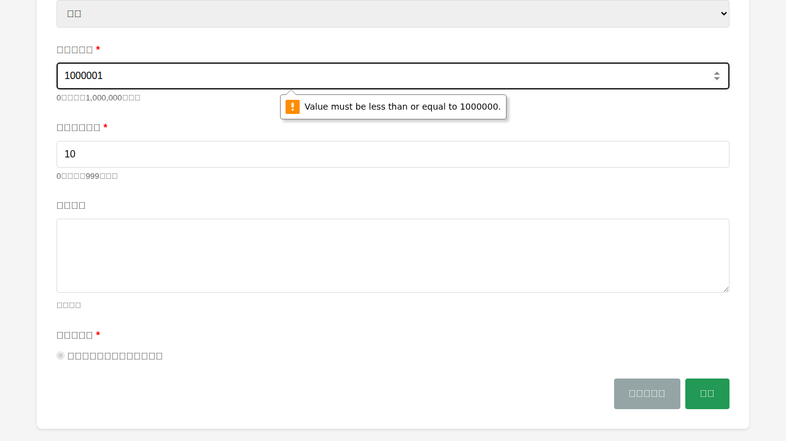
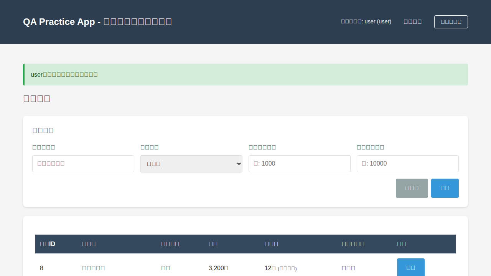
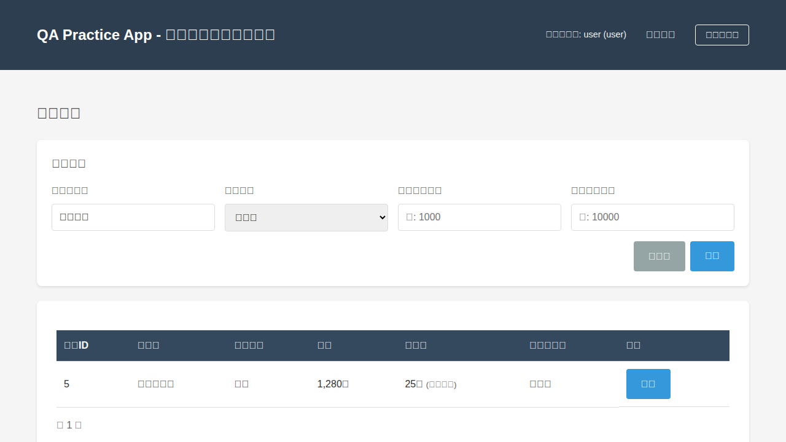

# QA Practice App 探索的テスト記録

## テスト実施情報

- **テスト実施日時**: 2025年11月2日 05:13 - 05:45 UTC
- **テストツール**: Playwright (playwright-MCP)
- **テスト実施者**: QA Engineer (2年目想定)
- **テスト対象**: QA Practice App v1.0 (Flask 3.0.0)

## 探索タイムラインとスクリーンショット

| 時刻 | ページURL | 実施内容 | スクリーンショット |
|------|-----------|----------|-------------------|
| 05:15 | `/login` | ログインページへアクセス。テスト用アカウント情報が明記されている。 |  |
| 05:17 | `/products` | 管理者(admin)でログイン成功。商品一覧ページが表示され、8件の商品が登録済み。在庫数による色分けが確認できる（在庫切れ=赤、残りわずか=黄） |  |
| 05:19 | `/products?keyword=バグ票` | 意図的なバグのテスト：検索キーワードに「バグ票」を入力して検索実行。予想通り500エラーが発生。 |  |
| 05:22 | `/products/new` | 新規商品登録画面へ遷移。必須項目とバリデーションルールが明記されている。ステータスは「準備中」固定。 |  |
| 05:25 | `/products/9/edit` | XSS脆弱性のテスト：商品説明に``を入力して登録。編集画面で確認すると、スクリプトタグがそのまま表示されている。 |  |
| 05:28 | `/products/new` | 境界値テスト：価格に1,000,001円（上限超過）を入力して登録試行。バリデーションエラーが発生し、フォームに残る。 |  |
| 05:30 | `/products` | 削除機能のテスト：XSSテスト商品の削除ボタンをクリック。確認ダイアログなしで即座に削除された。 |  |
| 05:35 | `/products` | 一般ユーザー(user)でログイン。商品一覧は表示されるが、「新規登録」リンクと「削除」ボタンが非表示。権限制御が機能している。 |  |
| 05:40 | `/products?keyword=コーヒー` | 検索機能のテスト：キーワード「コーヒー」で検索。該当する1件が正常に表示された。 |  |

## 探索した機能一覧

### 1. ユーザー認証・認可機能
- ✅ ログイン機能（admin / user）
- ✅ ログアウト機能
- ✅ 権限による機能制限（adminは全操作可、userは閲覧と編集のみ）
- ⚠️ **バグ発見**: ログアウトボタンのHTTPメソッド不一致（405エラー）

### 2. 商品CRUD操作
- ✅ 商品一覧表示
- ✅ 商品詳細表示（編集画面）
- ✅ 商品新規登録（admin のみ）
- ✅ 商品編集（admin / user）
- ✅ 商品削除（admin のみ）
- ⚠️ **バグ発見**: 削除時に確認ダイアログがない

### 3. 商品検索機能
- ✅ キーワード検索（商品名の部分一致）
- ✅ カテゴリ検索（書籍、家電、食品、その他）
- ✅ 価格範囲検索（下限・上限）
- ⚠️ **バグ発見**: 「バグ票」検索で500エラー（意図的）

### 4. 入力バリデーション
- ✅ 商品名: 1〜50文字（境界値テスト可能）
- ✅ 価格: 0〜1,000,000円（境界値テスト可能）
- ✅ 在庫数: 0〜999個（境界値テスト可能）
- ✅ バリデーションエラー時のメッセージ表示

### 5. 在庫ステータス表示
- ✅ 在庫数 = 0: 「在庫切れ」（背景色: 赤）
- ✅ 1 ≤ 在庫数 ≤ 10: 「残りわずか」（背景色: 黄）
- ✅ 在庫数 > 10: 「在庫あり」（背景色なし）

### 6. 商品ステータス遷移
- ✅ 新規登録時: 「準備中」固定
- ✅ 「準備中」→「公開中」: 遷移成功
- ✅ 「準備中」→「非公開」: 遷移可能（未テスト）
- ✅ 「公開中」→「非公開」: 遷移可能（未テスト）
- ✅ 状態遷移ルールの説明が編集画面に表示される

### 7. セキュリティ
- ⚠️ **脆弱性発見**: XSS（クロスサイトスクリプティング）が可能
- ⚠️ 商品説明フィールドでHTMLタグがエスケープされない

## QAエンジニアとしての所感

### 良かった点

1. **テスト自動化への配慮が素晴らしい**
   - すべての重要な要素に `data-testid` 属性が付与されている
   - Playwright でのテスト自動化が非常にスムーズに行えた
   - READMEにtest-idの一覧が記載されているのは親切

2. **意図的な不具合がテスト技法の練習に最適**
   - 「バグ票」検索の500エラーは、エラー推測テストの良い教材
   - XSS脆弱性は、セキュリティテストの実践に役立つ
   - 削除確認なしは、ユーザビリティテストの題材として優秀

3. **ドキュメントが充実**
   - README.mdに仕様とテスト技法の練習例が詳細に記載
   - PRD.mdで要件が明確
   - バリデーションルールがフォームに明記されている

4. **起動が簡単**
   - `pip install` と `python app.py` だけで動く
   - データベースの初期化も自動
   - サンプルデータが最初から入っている

### 改善してほしい点（QA練習アプリとして）

1. **もっと多様なテスト技法を練習したい**
   - デシジョンテーブルテストの題材が在庫表示のみ
   - ペアワイズ法を練習できる、より複雑な検索条件の組み合わせがあると良い
   - 等価分割法の練習題材をもう少し増やしてほしい

2. **状態遷移テストをもっと深く学びたい**
   - 現状は3つのステータス間の遷移のみ
   - もう少し複雑な状態遷移（例：承認フロー）があると実践的
   - 不正な状態遷移を試したときのエラーメッセージも見てみたかった

3. **APIテストの練習ができない**
   - 現状はGUIのみ
   - REST APIエンドポイントがあれば、Postman やcurl での練習ができる
   - JSONレスポンスのバリデーションも学びたい

4. **パフォーマンステストの題材がない**
   - 意図的に遅いエンドポイントがあると良い
   - 大量データの表示（ページネーション）のテストができると実践的

5. **バグトラッキングの練習ができない**
   - 発見したバグをどう記録すべきか学びたい
   - バグ票のテンプレートや書き方のガイドがあると助かる

### アプリの使い勝手について

1. **分かりやすいUI**
   - シンプルで直感的
   - 日本語UI なので理解しやすい
   - フラッシュメッセージで操作結果が明確

2. **気になる点**
   - エラーメッセージの表示位置が分かりにくい場合がある
   - ログアウトボタンが405エラーになる（バグ？）
   - 削除の確認ダイアログがないのは危険（意図的だが、本来あるべき）

3. **テスト自動化しやすい**
   - data-testid が統一された命名規則
   - ページ構造がシンプル
   - JavaScriptによる動的な変更が少ない

## 総括

このアプリは **QA初心者が基本的なテスト技法を実践的に学ぶ** には非常に良い教材です。特に、同値分割・境界値分析、デシジョンテーブル、状態遷移テストの基礎を手を動かして学べる点が素晴らしいです。

テスト自動化の練習にも最適で、Playwright を使った E2E テストの実装がスムーズに行えました。意図的に仕込まれた不具合も、バグ発見の練習として有用です。

ただし、QA 2年目としては、もう少し複雑で実践的な題材も欲しいと感じました。例えば、APIテスト、パフォーマンステスト、より複雑な状態遷移、セキュリティテスト（認証・認可の詳細なテスト）などがあれば、さらにスキルアップできると思います。

**評価**: ⭐⭐⭐⭐☆ (5段階中4)

- QA 初心者（1年目）には ⭐⭐⭐⭐⭐
- QA 中級者（2年目）には ⭐⭐⭐⭐☆
- QA 上級者（3年目以上）には ⭐⭐⭐☆☆

今後、REST API や より複雑な業務ロジックが追加されることを期待しています！
