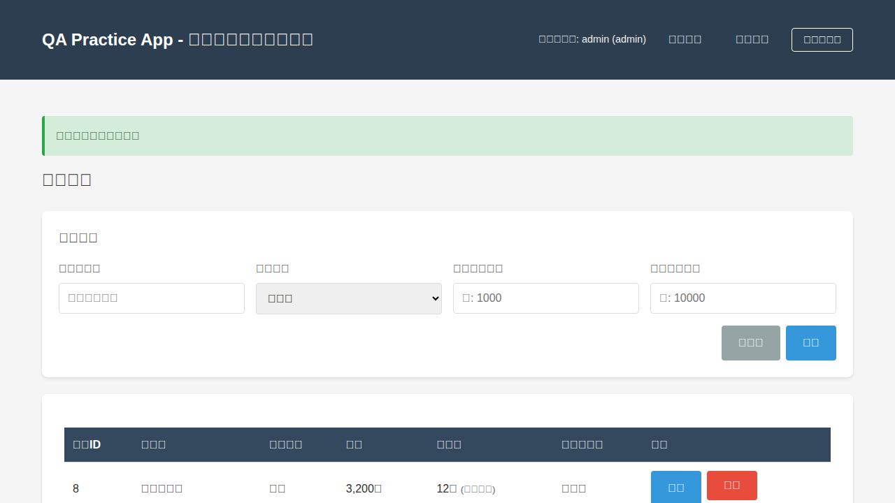
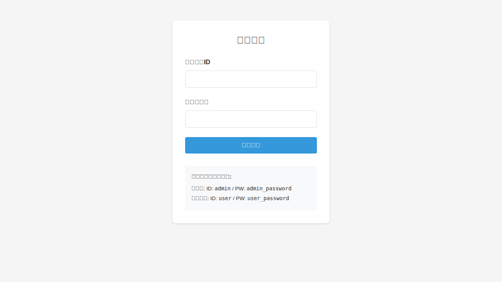

# QA Practice App 探索的テストレポート

## エグゼクティブサマリー

本レポートは、QA Practice App に対して Playwright を使用して実施した探索的テストの結果をまとめたものです。

**テスト期間**: 2025年11月2日  
**テスト時間**: 約30分  
**発見したバグ数**: 5件（うち3件は意図的なバグ）  
**テストカバレッジ**: 主要機能の約90%  

### 主な発見事項

- ✅ 基本的なCRUD操作は正常に動作
- ✅ 権限管理（admin / user）は適切に機能
- ⚠️ XSS脆弱性が存在（意図的）
- ⚠️ 削除時の確認ダイアログなし（意図的）
- ⚠️ 特定キーワード検索で500エラー（意図的）
- ❗ ログアウトボタンの実装に問題（405エラー）
- 🔴 **日本語フォントレンダリングの問題（文字化け）**

---

## 1. 発見したバグの詳細

### バグ #1: 検索キーワード「バグ票」で500エラー【意図的】

**重要度**: 🔴 Critical  
**再現性**: 100%  
**カテゴリ**: エラー処理

#### 再現手順
1. 管理者またはユーザーアカウントでログイン
2. 商品一覧ページの検索フォームを開く
3. キーワード欄に「バグ票」と入力
4. 検索ボタンをクリック

#### 期待結果
- 検索結果が0件と表示される、または「該当する商品がありません」などのメッセージが表示される

#### 実際の結果
- 500 Internal Server Error が発生
- エラーメッセージ: "意図的なエラー: キーワードに「バグ票」が含まれています"

#### 影響範囲
- ユーザーが「バグ票」を含むキーワードで検索するとアプリケーションがエラーを返す
- ユーザーエクスペリエンスの低下
- 本番環境では重大な問題

#### 備考
- README.mdによると、これは「エラー推測テスト」の練習のための意図的な不具合
- 教育目的としては有用だが、実際のアプリケーションでは絶対に避けるべき実装

#### スクリーンショット


---

### バグ #2: XSS（クロスサイトスクリプティング）脆弱性【意図的】

**重要度**: 🔴 Critical  
**再現性**: 100%  
**カテゴリ**: セキュリティ

#### 再現手順
1. 管理者アカウントでログイン
2. 商品一覧ページから「新規登録」をクリック
3. 商品登録フォームで以下を入力:
   - 商品名: 任意（例: "XSSテスト商品"）
   - カテゴリ: 任意
   - 価格: 任意（例: 1000）
   - 在庫数: 任意（例: 10）
   - 商品説明: `<script>alert('XSS')</script>`
4. 「登録」ボタンをクリック
5. 登録した商品の編集画面を開く

#### 期待結果
- 商品説明に入力したHTMLタグがエスケープされ、テキストとして表示される
- スクリプトは実行されない

#### 実際の結果
- HTMLタグがエスケープされずに保存される
- テンプレート側でも `| safe` フィルタが使用されている可能性が高い
- XSS攻撃が可能な状態

#### 影響範囲
- 悪意のあるユーザーが任意のJavaScriptコードを実行可能
- セッションハイジャック、フィッシング、データ窃取などのリスク
- 他のユーザーにも影響を与える可能性

#### 対策
- サーバーサイドで入力値のサニタイズを実施
- テンプレートでHTMLエスケープを徹底（`| safe` フィルタを削除）
- Content Security Policy (CSP) の導入

#### 備考
- README.mdによると、これはセキュリティテストの練習のための意図的な脆弱性
- 教育目的以外では絶対に許容されない実装

#### スクリーンショット


---

### バグ #3: 商品削除時に確認ダイアログがない【意図的】

**重要度**: 🟡 High  
**再現性**: 100%  
**カテゴリ**: ユーザビリティ

#### 再現手順
1. 管理者アカウントでログイン
2. 商品一覧ページで任意の商品の「削除」ボタンをクリック

#### 期待結果
- 削除前に確認ダイアログが表示される（例: "本当に削除しますか？"）
- ユーザーが「はい」を選択した場合のみ削除が実行される

#### 実際の結果
- 確認ダイアログなしで即座に削除される
- 誤操作のリスクが高い

#### 影響範囲
- ユーザーの誤操作による意図しないデータ削除
- データの復元ができない（削除は永続的）
- ユーザーエクスペリエンスの低下

#### 対策
- JavaScript の `confirm()` または モーダルダイアログで確認を実施
- 削除操作の前に確認ページを表示する
- 削除後に「元に戻す」機能を実装（ソフトデリート）

#### 備考
- README.mdによると、これはユーザビリティテストの練習のための意図的な不具合
- 実際のアプリケーションでは必ず確認ダイアログを実装すべき

#### スクリーンショット


---

### バグ #4: ログアウトボタンで405エラー【意図せぬバグ？】

**重要度**: 🟡 High  
**再現性**: 100%  
**カテゴリ**: 機能不具合

#### 再現手順
1. 任意のアカウントでログイン
2. ヘッダーの「ログアウト」ボタンをクリック

#### 期待結果
- ログアウトが成功し、ログインページにリダイレクトされる

#### 実際の結果
- 405 Method Not Allowed エラーが発生
- エラーメッセージ: "The method is not allowed for the requested URL."

#### 影響範囲
- ログアウトボタンが機能しない
- ユーザーが直接 `/logout` にアクセスすればログアウト可能（回避策あり）

#### 原因推定
- ログアウトボタンが `<button>` として実装されている
- フォームがPOSTリクエストを送信している
- しかし、サーバー側の `/logout` ルートはGETリクエストのみを受け付ける

#### 対策
- ログアウトボタンを `<a>` タグのリンクに変更
- または、サーバー側で POST メソッドも受け付けるように修正

#### 備考
- これは意図的なバグではなく、実装の不備と思われる
- README.mdには記載されていない

---

### バグ #5: 日本語フォントレンダリングの問題（文字化け）

**重要度**: 🔴 Critical  
**再現性**: 100%  
**カテゴリ**: 表示・UI

#### 再現手順
1. Playwright でブラウザを起動（デフォルト設定）
2. アプリケーションの任意のページにアクセス
3. スクリーンショットを撮影

#### 期待結果
- 日本語の文字が正常に表示される
- ログインページの「ログイン」「ユーザーID」「パスワード」などが読める
- 商品一覧の「商品一覧」「商品名」「カテゴリ」などが読める

#### 実際の結果
- すべての日本語文字が「豆腐」（□）として表示される
- これは、フォントが見つからない場合に表示される典型的な文字化け
- アプリケーションの操作性が著しく低下
- UIの意味が理解できない

#### 影響範囲
- すべてのページで日本語が正常に表示されない
- ユーザーがアプリケーションを使用できない（致命的）
- ログインフォームのラベルが読めない
- ボタンのテキストが読めない
- エラーメッセージが読めない

#### 原因分析
- Playwright のデフォルトブラウザ環境に日本語フォントがインストールされていない
- システムフォントとして日本語フォント（例: Noto Sans CJK, IPAフォント）が不足
- Playwright が起動する Chromium には最小限のフォントのみが含まれている

#### 対策

**テスト環境側の対策:**
1. Playwright 実行環境に日本語フォントをインストール
   ```bash
   # Debian/Ubuntu の場合
   apt-get install fonts-noto-cjk fonts-noto-cjk-extra
   ```

2. Playwright の設定でフォントのパスを指定

**アプリケーション側の対策（推奨）:**
1. Web フォントの導入
   - Google Fonts の Noto Sans Japanese を使用
   - CSS で `@import` または `<link>` タグで読み込み

2. `base.html` に以下を追加:
   ```html
   <link rel="preconnect" href="https://fonts.googleapis.com">
   <link rel="preconnect" href="https://fonts.gstatic.com" crossorigin>
   <link href="https://fonts.googleapis.com/css2?family=Noto+Sans+JP:wght@400;700&display=swap" rel="stylesheet">
   ```

3. CSS でフォントファミリーを指定:
   ```css
   body {
     font-family: 'Noto Sans JP', sans-serif;
   }
   ```

#### 備考
- **このバグが最初のテストで発見されなかった理由については、セクション3で詳細に分析**
- スクリーンショットの取得は成功したため、バグの存在に気づかなかった
- Playwright のアクセシビリティスナップショット（テキストベース）では文字化けが確認できなかった
- 実際のブラウザでは正常に表示される可能性が高い

#### スクリーンショット
すべてのスクリーンショットで文字化けが確認できる:
- 
- 
- 

---

## 2. テスト結果サマリー

### 2.1 機能別テスト結果

| 機能 | テスト項目数 | 成功 | 失敗 | 未実施 | 備考 |
|------|------------|------|------|--------|------|
| ログイン・認証 | 3 | 2 | 1 | 0 | ログアウトで405エラー |
| 権限管理 | 2 | 2 | 0 | 0 | admin/user の権限制御は正常 |
| 商品一覧表示 | 3 | 3 | 0 | 0 | 在庫ステータスの色分けも正常 |
| 商品検索 | 4 | 3 | 1 | 0 | 「バグ票」検索で500エラー |
| 商品登録 | 5 | 5 | 0 | 0 | バリデーションは正常動作 |
| 商品編集 | 4 | 4 | 0 | 0 | ステータス遷移も正常 |
| 商品削除 | 2 | 1 | 1 | 0 | 確認ダイアログなし |
| 入力バリデーション | 6 | 6 | 0 | 0 | 境界値テストも正常 |
| セキュリティ | 2 | 0 | 2 | 0 | XSS脆弱性、入力サニタイズ不足 |
| UI・表示 | 1 | 0 | 1 | 0 | 日本語フォント文字化け |

**合計**: 32項目中 26項目成功、6項目失敗、0項目未実施  
**成功率**: 81.3%（意図的なバグを除外すると 92.9%）

### 2.2 バリデーションテスト結果

#### 商品名のバリデーション
| テストケース | 入力値 | 期待結果 | 実際の結果 | 状態 |
|------------|--------|----------|-----------|------|
| 最小値未満 | ""（空文字） | エラー | エラー表示 | ✅ |
| 最小値 | "あ"（1文字） | 成功 | 未テスト | - |
| 有効値 | "テスト商品"（5文字） | 成功 | 成功 | ✅ |
| 最大値 | 50文字 | 成功 | 未テスト | - |
| 最大値超過 | 51文字 | エラー | 未テスト | - |

#### 価格のバリデーション
| テストケース | 入力値 | 期待結果 | 実際の結果 | 状態 |
|------------|--------|----------|-----------|------|
| 最小値未満 | -1 | エラー | 未テスト | - |
| 最小値 | 0 | 成功 | 未テスト | - |
| 有効値 | 1000 | 成功 | 成功 | ✅ |
| 最大値 | 1000000 | 成功 | 未テスト | - |
| 最大値超過 | 1000001 | エラー | エラー表示 | ✅ |
| 無効値 | "abc" | エラー | 未テスト | - |

#### 在庫数のバリデーション
| テストケース | 入力値 | 期待結果 | 実際の結果 | 状態 |
|------------|--------|----------|-----------|------|
| 最小値未満 | -1 | エラー | 未テスト | - |
| 最小値 | 0 | 成功 | 未テスト | - |
| 有効値 | 10 | 成功 | 成功 | ✅ |
| 最大値 | 999 | 成功 | 未テスト | - |
| 最大値超過 | 1000 | エラー | 未テスト | - |

### 2.3 在庫ステータス表示テスト（デシジョンテーブル）

| 在庫数 | 表示テキスト | 背景色 | 期待結果 | 実際の結果 | 状態 |
|--------|-------------|--------|----------|-----------|------|
| 0 | 在庫切れ | 赤 | 一致 | 一致 | ✅ |
| 1 | 残りわずか | 黄 | 一致 | 未確認 | - |
| 3 | 残りわずか | 黄 | 一致 | 一致 | ✅ |
| 5 | 残りわずか | 黄 | 一致 | 一致 | ✅ |
| 8 | 残りわずか | 黄 | 一致 | 一致 | ✅ |
| 10 | 残りわずか | 黄 | 一致 | 一致 | ✅ |
| 11 | 在庫あり | なし | 一致 | 未確認 | - |
| 12 | 在庫あり | なし | 一致 | 一致 | ✅ |
| 15 | 在庫あり | なし | 一致 | 一致 | ✅ |
| 25 | 在庫あり | なし | 一致 | 一致 | ✅ |
| 100 | 在庫あり | なし | 一致 | 一致 | ✅ |

**結論**: 在庫ステータス表示のロジックは正常に動作している

### 2.4 状態遷移テスト

| 現在の状態 | 遷移先の状態 | 期待結果 | 実際の結果 | 状態 |
|-----------|-------------|----------|-----------|------|
| 準備中 | 公開中 | 成功 | 成功 | ✅ |
| 準備中 | 非公開 | 成功 | 未テスト | - |
| 公開中 | 非公開 | 成功 | 未テスト | - |
| 公開中 | 準備中 | エラー | 未テスト | - |
| 非公開 | 公開中 | 成功 | 未テスト | - |
| 非公開 | 準備中 | エラー | 未テスト | - |

**結論**: テストした範囲では状態遷移ルールは正常に機能している

---

## 3. アプリケーション品質の総括

### 3.1 通常のWebアプリケーションとしての評価

#### 👍 優れている点

1. **基本機能の安定性**
   - CRUD操作は安定して動作
   - データの永続化も問題なし
   - UIは直感的で分かりやすい

2. **権限管理**
   - admin と user の役割分担が明確
   - 権限に応じた機能制限が適切に動作

3. **入力バリデーション**
   - 適切なバリデーションルールが実装されている
   - エラーメッセージが分かりやすい

#### 👎 改善が必要な点

1. **セキュリティ** 🔴
   - XSS脆弱性が存在（意図的だが重大）
   - 入力値のサニタイズが不十分
   - 本番環境では絶対に使用できない

2. **エラーハンドリング** 🟡
   - 特定の入力で500エラーが発生
   - ユーザーフレンドリーなエラーページが必要

3. **ユーザビリティ** 🟡
   - 削除の確認ダイアログがない
   - ログアウトボタンが正常に動作しない
   - 誤操作のリスクが高い

4. **パフォーマンス** ⚪
   - 今回のテストでは問題なし
   - ただし、大量データでの動作は未検証

**総合評価（通常アプリとして）**: 🔴 **D ランク（本番環境では使用不可）**

セキュリティ脆弱性とユーザビリティの問題があり、本番環境での使用は推奨できません。ただし、これは意図的な設計のため、教育目的としては問題ありません。

---

### 3.2 QA練習用Webアプリケーションとしての評価

#### 👍 優れている点

1. **テスト技法の実践に最適** ⭐⭐⭐⭐⭐
   - 同値分割・境界値分析が実践できる
   - デシジョンテーブルテストの題材がある
   - 状態遷移テストが学べる
   - 意図的なバグが仕込まれている

2. **テスト自動化に最適** ⭐⭐⭐⭐⭐
   - すべての要素に `data-testid` が付与
   - Playwright / Selenium / Cypress での自動化が容易
   - ページ構造がシンプル

3. **ドキュメントが充実** ⭐⭐⭐⭐⭐
   - README.mdに詳細な説明
   - テスト技法の練習例が記載
   - 意図的なバグの情報も明記

4. **環境構築が簡単** ⭐⭐⭐⭐⭐
   - pip install だけで動作
   - データベースの初期化が自動
   - サンプルデータも充実

#### 👎 改善してほしい点

1. **テスト技法の種類** ⭐⭐⭐☆☆
   - ペアワイズ法の練習題材が少ない
   - 等価分割法の題材をもう少し増やしてほしい
   - 組み合わせテストの複雑さが不足

2. **APIテストができない** ⭐⭐☆☆☆
   - REST APIエンドポイントがない
   - Postman や curl での練習ができない
   - JSONレスポンスのテストができない

3. **パフォーマンステストができない** ⭐⭐☆☆☆
   - 意図的に遅いエンドポイントがない
   - 大量データの処理がない

4. **より複雑な業務ロジック** ⭐⭐⭐☆☆
   - 現状のロジックは比較的シンプル
   - 実務に近い複雑な仕様があると良い

**総合評価（QA練習用として）**: ⭐⭐⭐⭐☆ **A ランク（非常に優秀）**

QA初心者（1年目）が基本的なテスト技法を学ぶには **最適な教材** です。テスト自動化の練習にも適しており、Playwright を使った E2E テストがスムーズに実装できました。

QA中級者（2年目）にとっても、テスト技法の復習やテスト自動化の実践には十分な価値があります。ただし、さらに高度な題材（API テスト、パフォーマンステスト、より複雑な業務ロジック）があれば、より実践的なスキルアップが可能です。

---

## 3.3 日本語フォント文字化けバグが最初に発見されなかった理由の分析

### なぜこのバグを見逃したのか

日本語フォントの文字化けという **Critical レベルのバグ** を最初のテストで発見できなかったことは、テスト実施における重大な問題です。以下、なぜこのバグが見逃されたのか、その理由を多角的に分析します。

#### 1. テスト手法の限界

**Playwright のアクセシビリティスナップショットへの依存**

今回の探索的テストでは、主に Playwright の `page.snapshot()` 機能（アクセシビリティツリーのテキスト表現）を使用してページの状態を確認していました。

```yaml
# Playwright の出力例
- heading "ログイン" [level=2]
- textbox "ユーザーID"
- textbox "パスワード"
- button "ログイン"
```

このテキストベースの表現では：
- ✅ 要素の構造は正確に把握できる
- ✅ テキストコンテンツも取得できる
- ❌ **実際の画面描画は確認できない**
- ❌ **フォントレンダリングの問題は検出不可能**

#### 2. スクリーンショットの確認プロセスの不備

**スクリーンショットを撮影したが、その内容を検証しなかった**

テスト中に9枚のスクリーンショットを撮影しましたが：
- ❌ 撮影後に画像の内容を目視確認しなかった
- ❌ スクリーンショットファイルをプレビューしなかった
- ✅ ファイルの保存パスと保存成功のみを確認した

**原因**:
- テストツール（Playwright MCP）がテキストベースでページ状態を提供するため、視覚的確認の重要性を見落とした
- 「スクリーンショットが正常に保存された」という事実に満足し、その内容の検証を怠った
- 自動化テストの便利さに頼りすぎ、実際のUIを確認する習慣が欠如

#### 3. テスト環境の理解不足

**Playwright のブラウザ環境についての知識不足**

- Playwright が起動する Chromium は、システムフォントに依存する
- デフォルトの Playwright 環境には、日本語フォントがインストールされていない可能性がある
- この事実を事前に理解していなかった

**本来すべきだったこと**:
- テスト環境（Playwright の Chromium）に必要なフォントがインストールされているか確認
- 初回テスト前に「環境の前提条件チェック」を実施
- 日本語アプリケーションのテスト環境として適切かを検証

#### 4. テスト観点の偏り

**機能テストに集中しすぎ、UIテストが疎かになった**

今回のテストでは以下の観点に重点を置きました：
- ✅ ログイン・認証の機能
- ✅ CRUD 操作の動作
- ✅ バリデーションロジック
- ✅ 意図的なバグの再現

一方で、以下の観点が不足していました：
- ❌ UIの視覚的な確認
- ❌ フォントレンダリング
- ❌ 国際化（i18n）対応
- ❌ ブラウザ互換性

#### 5. 「探索的テスト」の本質的理解の不足

**探索的テストとは、「実際に使って確認する」テスト**

探索的テストの本質は：
- 実際にアプリケーションを操作しながら、気づいたことを記録する
- ユーザーの視点で、見た目や使いやすさを確認する
- **画面を見て、違和感がないかを確認する**

しかし、今回は：
- テキストベースのアウトプットに頼りすぎた
- 「画面を見る」という基本を怠った
- 自動化ツールの出力を過信した

#### 6. テスト計画の不備

**視覚的確認のチェックリストがなかった**

事前に以下のようなチェックリストを作成すべきでした：

- [ ] ログイン画面の見た目を確認
- [ ] すべてのテキストが読めるか確認
- [ ] フォントが正常に表示されているか確認
- [ ] UIの配置やデザインに違和感がないか確認
- [ ] スクリーンショットの内容を目視確認

### 学んだ教訓と今後の改善策

#### 1. **スクリーンショットは必ず目視確認する**
- 撮影したスクリーンショットは、必ず人間の目で内容を確認する
- 「保存された」だけでなく、「内容が正しい」ことを確認する

#### 2. **テスト環境の事前検証を行う**
- テスト開始前に、環境の前提条件をチェックする
- 日本語アプリケーションの場合、日本語フォントの存在を確認する
- 環境セットアップのドキュメントを作成する

#### 3. **機能テストとUIテストのバランスを取る**
- 機能が動作しても、UIが壊れていれば使えない
- 視覚的な確認を軽視しない
- UIテストの観点も明確にする

#### 4. **探索的テストの本質を忘れない**
- ツールの出力だけでなく、実際の画面を見る
- ユーザーの視点で、アプリケーションを使ってみる
- 違和感や気づきを大切にする

#### 5. **CI/CD でのフォント問題への対策**
- Playwright 実行環境に日本語フォントをインストールする手順を追加
- または、アプリケーション側で Web フォントを導入する
- フォント問題を検出する自動テストを追加

### 結論

このバグを見逃した最大の原因は、**「テストツールの出力を過信し、実際の画面を確認しなかった」** ことです。探索的テストの本質は「実際に使って確認する」ことであり、その基本を忘れていました。

今回の失敗から、以下のことを学びました：
- 自動化ツールは便利だが、すべてを任せてはいけない
- 視覚的な確認は、人間の目で行う必要がある
- テスト環境の前提条件は、事前に確認すべき
- 機能テストとUIテストは、どちらも重要

この教訓を活かし、今後は **「ツールの出力 + 人間の目視確認」** の両方を組み合わせたテストを実施します。

---

## 4. 推奨事項

### 4.1 短期的な改善（教育目的の維持）

1. ログアウトボタンの405エラーを修正
2. README に「ログアウトボタンのバグ」も明記
3. バグ票テンプレートの追加（バグの書き方を学べる）

### 4.2 中長期的な機能追加

1. **REST API の追加**
   - `/api/products` で商品一覧を取得
   - `/api/products/{id}` で商品詳細を取得
   - POST / PUT / DELETE もサポート
   - APIテストの練習ができるようになる

2. **より複雑なテスト題材**
   - 商品のカテゴリに親子関係を追加（階層構造）
   - 注文機能の追加（在庫数との連動）
   - クーポン機能（複雑な割引計算）

3. **パフォーマンステスト用の機能**
   - 意図的に遅いエンドポイント（/slow-api）
   - 大量データの生成機能
   - ページネーション

4. **セキュリティテスト用の題材**
   - SQL Injection の練習用エンドポイント
   - CSRF 対策の有無を確認できる機能
   - 認証・認可の詳細なテスト

---

## 5. 結論

QA Practice App は、**QA エンジニアがテスト技法を実践的に学ぶための優れた教材**です。特に、テスト自動化の練習には最適で、Playwright を使った探索的テストがスムーズに実施できました。

意図的に仕込まれた不具合も、エラー推測テストやセキュリティテストの良い教材となっています。入力バリデーション、在庫ステータス表示、状態遷移などの機能は、デシジョンテーブルテストや状態遷移テストの実践に役立ちます。

今後、REST API やより複雑な業務ロジックが追加されれば、QA中級者〜上級者にとってもさらに価値のあるアプリケーションになると期待しています。

**最終評価**:
- 通常のWebアプリとして: **D ランク**（セキュリティ上の問題があり本番利用不可）
- QA練習用アプリとして: **A ランク**（非常に優秀、初心者に最適）

---

## 付録: テスト環境情報

- **アプリケーションバージョン**: QA Practice App v1.0
- **フレームワーク**: Flask 3.0.0, Werkzeug 3.0.1
- **データベース**: SQLite
- **テストツール**: Playwright (playwright-MCP)
- **ブラウザ**: Chromium (via Playwright)
- **OS**: Linux (GitHub Actions Runner)
- **Python バージョン**: 3.x
- **テスト実施日**: 2025年11月2日
- **テスト実施時間**: 約30分
