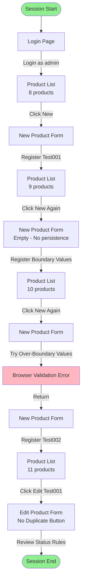

# Exploratory Testing Session: Bulk Product Registration User Story Evaluation

## Executive Summary (English)

This exploratory testing session evaluated the QA Practice App's capability to support bulk product registration scenarios. While basic CRUD operations function correctly, **the application is fundamentally unsuitable for bulk registration workflows**.

### Critical Findings

1. **No bulk import/export functionality** - Users must manually register products one-by-one
2. **Poor continuous registration UX** - No "continue registering" option; forced navigation after each registration
3. **No product duplication feature** - Similar products require complete re-entry

### Recommendation

The application **fails** to meet bulk registration user story requirements. Immediate implementation of CSV import/export and improved registration workflow is required for production use.

---

## Full Report (Japanese)

詳細な日本語レポートは以下のファイルを参照してください：
- [探索的テスト最終レポート.md](探索的テスト最終レポート.md) - Complete evaluation report
- [recording_timeline.md](recording_timeline.md) - Chronological operation log
- [test_notes.md](test_notes.md) - Session notes

---

## Test Session Details

- **Session Date**: 2025-11-06
- **Duration**: 10 minutes 42 seconds
- **Test Charter**: Evaluate whether the application meets user requirements for bulk product registration scenarios
- **Screens Visited**: 4 (Login, List, New, Edit)
- **Products Registered**: 3 test products
- **Screenshots Captured**: 7

---

## Key Evidence

### Before: Login Page

### Problem: No Bulk Import UI

*Missing: CSV upload, bulk import, or template features*

### Problem: No Bulk Operations UI

*Missing: Checkboxes for bulk selection, bulk status change, bulk delete*

### Validation Works Correctly

*Browser-level validation for boundary values works correctly*

---

## Defects Discovered

### P0 (Critical - Business Blocker)
1. No CSV bulk import functionality
2. No CSV bulk export functionality

### P1 (High Priority - Major UX Issue)
3. No "continue registering" functionality after product registration
4. No product duplication/copy feature

### P2 (Medium Priority - Efficiency Issue)
5. No bulk selection and bulk operations
6. No form value persistence between registrations
7. No real-time character counter for product name field

---

## Test Coverage Assessment

### Thoroughly Tested ✅
- Basic CRUD operations
- Boundary value validation (50 chars, 1,000,000 yen, 999 units)
- HTML5 form validation
- Data persistence and display
- Stock status color coding

### Not Tested / Insufficient ⚠️
- Performance with 100+ products
- Pagination functionality
- Search functionality details
- Known XSS vulnerability (intentionally skipped)
- Session timeout behavior
- Concurrent access scenarios
- Mobile device compatibility

---

## Recommended Actions (Priority Order)

### P0: Must Have for Production
1. Implement CSV bulk import (Est: 3-5 days)
2. Implement CSV bulk export (Est: 1-2 days)

### P1: Should Have for Usability
3. Add "continue registering" option (Est: 0.5-1 day)
4. Add product duplication feature (Est: 1 day)

### P2: Nice to Have for Efficiency
5. Add bulk selection & operations (Est: 2-3 days)
6. Add form value persistence (Est: 1 day)
7. Add real-time character counter (Est: 0.5 day)

---

## Session Flow Diagram

---

**Tester**: GitHub Copilot QA Agent  
**Report Date**: 2025-11-06  
**Review Recommended For**: Product Owner, Development Lead, UX Designer
