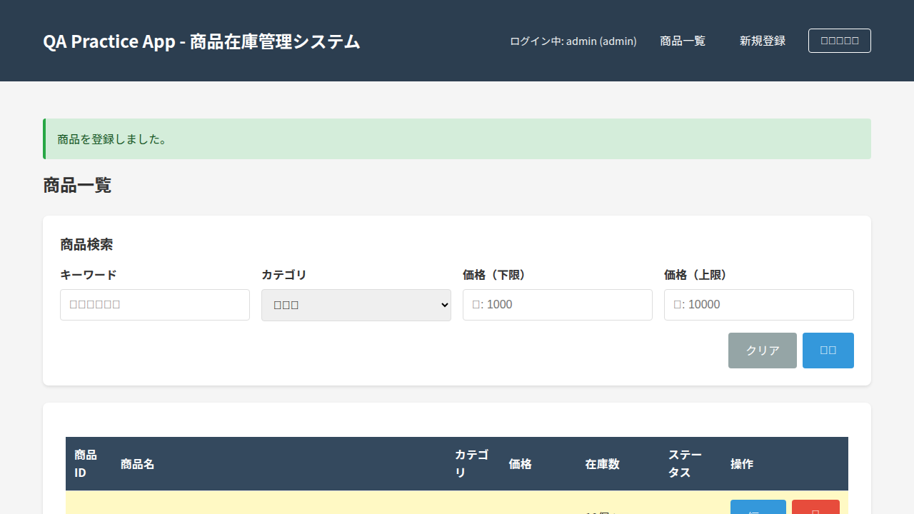
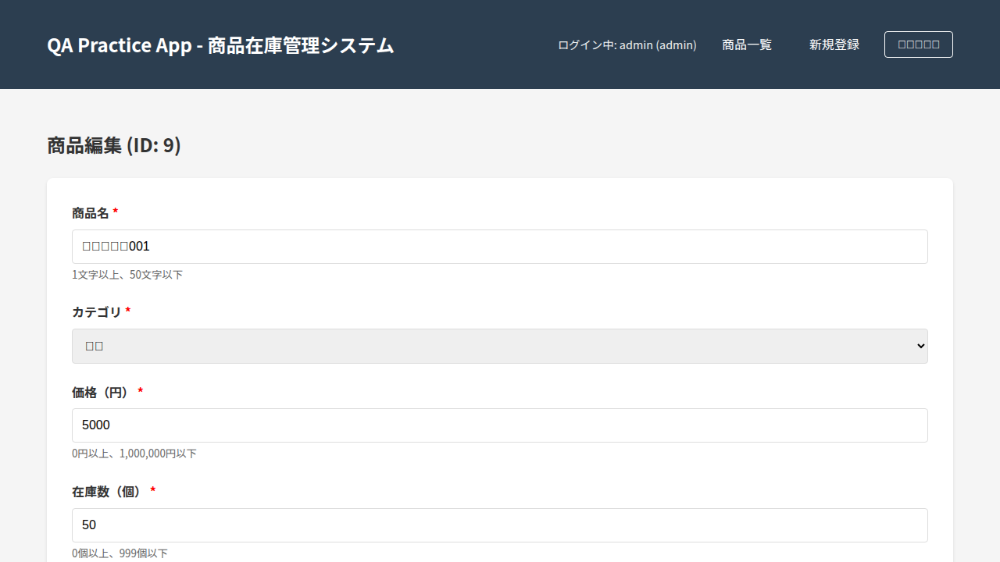

# 探索的テストセッション記録タイムライン

## セッション情報
- **日時**: 2025-11-06
- **テスター**: GitHub Copilot QA Agent
- **対象アプリケーション**: QA Practice App (商品在庫管理システム)
- **タイムボックス**: 10分間
- **テーマ**: 商品大量登録時のユーザーストーリーに基づく探索的テスト

## テストチャーター

### ミッション
ユーザーが商品データを大量に登録するシナリオにおいて、ユーザーの要求が満たされているかを評価する。特に、効率性、エラー処理、データ整合性、ユーザビリティの観点から重要なリスクを特定する。

### ターゲット機能・ワークフロー
1. 商品の新規登録フロー
2. 商品の一覧表示と検索
3. 商品の編集フロー
4. 入力バリデーションとエラーメッセージ
5. 繰り返し操作時の効率性とユーザビリティ

### 最重要リスク
- **ビジネスリスク**: 大量登録時のデータ損失、誤入力による在庫データの不整合
- **機能リスク**: バリデーションの不備、エラー時の操作継続性
- **セキュリティリスク**: XSS脆弱性、SQLインジェクション
- **ユーザビリティリスク**: 繰り返し操作時の効率低下、エラーメッセージの不明瞭さ

### 適用するヒューリスティック（優先順位順）
1. **A. ミッション&コンテキスト**: 大量登録時の最悪の失敗（データ損失、重複、破壊）から逆算
2. **B. データ多様性**: 境界値、特殊文字、極端な入力値
3. **C. 状態遷移**: 連続的な登録→編集→削除のフロー
4. **D. 並行性&順序**: 連続的な登録操作、高速クリック
5. **E. 永続性&同期**: 保存→リロード→データ整合性
6. **F. エラーハンドリング**: 必須項目の欠落、バリデーションエラー時の挙動
7. **G. ユーザーレンズ**: 繰り返し操作時のUX問題点
8. **H. ビジネス整合性**: 在庫数、価格の計算と表示
9. **I. セキュリティ**: XSS、既知の脆弱性確認
10. **J. リグレッショントラップ**: 修正が他機能に影響していないか

### カバレッジメトリクス目標
- 訪問画面数: 最低4画面（ログイン、一覧、登録、編集）
- 入力パターン数: 最低10パターン（正常、境界値、異常値）
- 発見した欠陥数: 記録

## 操作記録

| 時刻 | ページURL | 実行した操作 | スクリーンショット |
|------|-----------|-------------|-------------------|
| 16:29:14 | `/login` | ログインページにアクセス。テスト用アカウント情報が明示されている |  |
| 16:29:30 | `/products` | 管理者（admin）としてログイン成功。商品一覧ページに遷移。8件の既存商品を確認 |  |
| 16:30:15 | `/products/new` | 「新規登録」リンクをクリック。商品登録フォームが表示された |  |
| 16:30:45 | `/products` | テスト商品001を登録（価格5000円、在庫50個）。登録成功後、一覧ページに自動遷移 |  |
| 16:31:30 | `/products` | 境界値テスト: 商品名50文字、価格1,000,000円、在庫999個で登録成功 |  |
| 16:32:15 | `/products/new` | 境界値超過テスト: 商品名51文字、価格1,000,001円、在庫1000個を入力。ブラウザバリデーションエラーが表示された |  |
| 16:34:00 | `/products` | テスト商品002を登録（価格1500円、在庫10個、残りわずか表示確認） |  |
| 16:35:30 | `/products/9/edit` | テスト商品001の編集画面を確認。複製ボタンが存在しないことを確認 |  |
| 16:39:56 | - | セッション終了。テストノート作成とまとめ作業 | - |

## 取得したすべてのスクリーンショット

1. [step01_login_page.png](screenshots/step01_login_page.png) - ログインページ
2. [step02_products_list.png](screenshots/step02_products_list.png) - 商品一覧ページ（初期状態）
3. [step03_new_product_form.png](screenshots/step03_new_product_form.png) - 商品登録フォーム
4. [step04_boundary_product_registered.png](screenshots/step04_boundary_product_registered.png) - 境界値での登録成功後
5. [step05_validation_error_no_message.png](screenshots/step05_validation_error_no_message.png) - バリデーションエラー表示
6. [step06_multiple_products_registered.png](screenshots/step06_multiple_products_registered.png) - 複数商品登録後の一覧
7. [step07_edit_page.png](screenshots/step07_edit_page.png) - 商品編集ページ

## セッション終了後の所見

**合計登録商品数**: 3件（テスト商品001, 境界値商品, テスト商品002）  
**訪問画面数**: 4画面（ログイン、一覧、登録、編集）  
**発見した重大な問題**: 3件
1. 一括インポート機能の欠如
2. 連続登録時のUX問題
3. 商品複製機能の欠如

詳細は「探索的テスト最終レポート.md」を参照。
