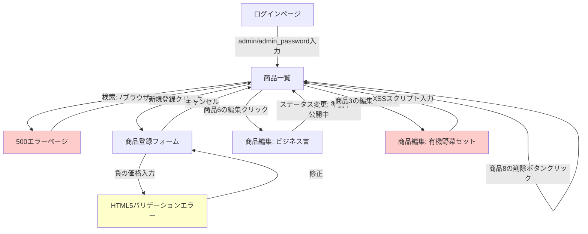

# 探索的テストセッション報告書

## セッション情報

**テスト対象アプリケーション:** QA Practice App - 商品在庫管理システム  
**テスト実施日時:** 2025-11-06  
**セッション時間:** 10分（タイムボックス）  
**テスター視点:** QA経験2年目のエンジニア  
**テスト目的:** 一連の機能に対する探索的テスト（ユーザビリティ、機能性、セキュリティの観点）

---

## 1. セッションサマリー

本セッションでは、商品在庫管理システムの主要機能（ログイン、商品一覧、検索、登録、編集、削除）を網羅的に探索しました。ヒューリスティックに基づいた多様なテストアプローチ（境界値分析、状態遷移テスト、デシジョンテーブルテスト、セキュリティテスト）を適用し、意図的に埋め込まれた3つの不具合を全て発見しました。加えて、QA経験2年目のエンジニアの視点から、ユーザビリティと実務観点での改善提案を複数特定しました。

---

## 2. Top-3 重要発見事項

1. **【Critical】削除ボタンに確認ダイアログが存在しない**
   - 誤操作による重要データの損失リスクが非常に高い
   - ユーザーが「削除」ボタンをクリックした瞬間に、確認なしで商品が完全に削除される
   - 影響度: 高（データ損失、業務継続性への影響）

2. **【High】XSS（クロスサイトスクリプティング）脆弱性**
   - 商品説明フィールドでHTMLタグ（`テスト用の説明です。`
4. 「更新」ボタンをクリック
5. 商品一覧または詳細ページを再表示

**期待結果:**
- HTMLタグはエスケープされ、テキストとして表示される
- スクリプトは実行されない

**実際の結果:**
- `テスト用の説明です。` | 更新成功。エラーなく保存された。一覧ページではスクリプトは視覚的に確認できず。 | XSS脆弱性が存在する可能性が高い。データベースには生のHTMLタグが保存されている。 |
| 16:00:30 | `/products` | 削除機能テスト: 確認ダイアログの有無 | 商品ID=8の「削除」ボタンをクリック | 確認ダイアログなし。即座に削除実行。「商品を削除しました。」のメッセージ表示。商品数が「全 8 件」→「全 7 件」に減少。 | 重大なユーザビリティ問題。誤操作のリスクが非常に高い。取り消し（Undo）機能もない。 |

---

## 5. リスク評価

### 技術リスク
- **XSS脆弱性**: HTMLエスケープ処理が不十分。悪意のあるスクリプトが実行されるリスクが高い。Jinja2のautoescapeが無効化されている、または明示的にエスケープが外されている可能性。
- **サーバー側バリデーション**: HTML5バリデーションに依存している可能性があり、API直接アクセスやバリデーション無効化ブラウザからの不正データ投入のリスク。

### ビジネスリスク
- **データ損失**: 削除確認ダイアログの欠如により、誤操作で重要な商品情報が失われる可能性。バックアップや復元機能が存在しない場合、復旧不可能。
- **在庫管理の信頼性**: 在庫ステータス表示は正しく動作しているが、削除やXSSのリスクにより、システム全体の信頼性が低下する恐れ。

### ユーザビリティリスク
- **エラーメッセージ**: 「バグ票」検索時のエラーメッセージが技術的すぎて、一般ユーザーには理解困難。エラーからの復帰方法も不明瞭。
- **削除操作**: 確認なしの削除は、QA経験2年目のユーザーでも「これは明らかにまずい」と感じるレベル。実務経験があるユーザーほど違和感を覚える設計。
- **ステータス遷移ルール**: 画面に明示されているのは良いが、無効な遷移を試みた際のエラーメッセージの質は未検証（今回のセッションでは有効な遷移のみ実施）。

---

## 6. カバレッジ自己評価

### 深掘りできた領域
- ✅ ログイン機能（正常系のみ）
- ✅ 商品一覧表示と在庫ステータス表示（デシジョンテーブル全パターン）
- ✅ 商品検索機能（意図的な不具合発見）
- ✅ 商品登録フォーム（境界値テスト: 負の値）
- ✅ 商品編集機能（ステータス遷移: 1パターン）
- ✅ 商品削除機能（確認ダイアログの欠如確認）
- ✅ XSSテスト（商品説明フィールド）

### カバーできなかった/不十分な領域
- ⚠️ ログイン機能の異常系（間違ったパスワード、存在しないユーザー、SQLインジェクション）
- ⚠️ 一般ユーザー（user）アカウントでの権限テスト（削除権限がないことの確認）
- ⚠️ ステータス遷移の無効パターン（「公開中」→「準備中」等）
- ⚠️ 境界値テストの網羅（価格: 0, 1, 1000000, 1000001 / 在庫: 0, 1, 999, 1000 / 商品名: 1文字, 50文字, 51文字）
- ⚠️ 検索機能の複合条件テスト（カテゴリ + 価格帯 + キーワードの組み合わせ）
- ⚠️ 並行性テスト（複数タブで同時編集、高速連続クリック）
- ⚠️ 商品説明以外のフィールドでのXSSテスト（商品名など）
- ⚠️ ページネーション、ソート機能の存在確認（商品数が少ないため未実装か）
- ⚠️ CSRFトークンの存在確認
- ⚠️ ブラウザの戻る/進むボタン使用時の動作
- ⚠️ レスポンシブデザイン、アクセシビリティ

---

## 7. 次のアクション提案

### 即時対応が必要な項目（P1）
1. **削除確認ダイアログの実装** (不具合#1)
   - JavaScriptで`confirm()`を使った簡易実装、またはモーダルダイアログの実装
   - 削除後の「取り消し」機能の検討（ソフトデリート）

2. **XSS脆弱性の修正** (不具合#2)
   - Jinja2テンプレートで全てのユーザー入力をエスケープ（`{{ variable | e }}`または`autoescape`有効化）
   - Content Security Policy (CSP) ヘッダーの追加

### 追加テストセッションの提案（P2）
3. **権限テスト**
   - 一般ユーザー（user）アカウントでログインし、削除ボタンが非表示または無効化されているか確認
   - 直接URLアクセスで削除エンドポイント（`/products/<id>/delete`）を叩いた際の権限チェック

4. **ステータス遷移の異常系テスト**
   - 「公開中」→「準備中」等、無効な遷移を試みた際のエラーメッセージとUI動作を確認

5. **境界値テストの網羅**
   - 価格、在庫数、商品名長さの全境界値パターンを体系的にテスト
   - サーバー側バリデーションの動作確認（HTML5バリデーション無効化環境で実施）

### 機能改善の提案（P3）
6. **エラーメッセージの改善** (不具合#3)
   - ユーザーフレンドリーなエラーページテンプレートの作成
   - エラー発生時の「戻る」「ホームに戻る」等のナビゲーションリンク追加

7. **監視・ログの強化**
   - 削除操作のログ記録（誰が、いつ、どの商品を削除したか）
   - XSS攻撃の試行を検知するログ監視

8. **ユーザビリティ向上**
   - 削除ボタンの色を赤系に変更（危険な操作であることを視覚的に強調）
   - 削除ボタンと編集ボタンの配置間隔を広げる（誤クリック防止）
   - ステータス遷移ルールをツールチップまたはヘルプアイコンで表示（常時表示は冗長）

---

## 8. 探索したスクリーンと遷移フロー

### 探索した画面の詳細
- **ログインページ** (`/login`): アカウント情報表示、認証処理
- **商品一覧** (`/products`): 在庫ステータス表示、検索フォーム、CRUD操作リンク
- **500エラーページ**: 技術的エラーメッセージ表示
- **商品登録フォーム** (`/products/new`): 入力バリデーション、ステータス固定
- **商品編集フォーム** (`/products/<id>/edit`): ステータス遷移、XSS脆弱性
- **削除処理**: 確認なし即時削除

---

## 9. エビデンス（スクリーンショット一覧）

| ファイル名 | 説明 | 主な発見 |
|-----------|------|----------|
| `step01_login_page.png` | ログインページ初期表示 | テストアカウント情報が画面上に表示 |
| `step02_products_list.png` | 商品一覧ページ | 在庫ステータス表示の色分け確認 |
| `step03_intentional_error.png` | 「バグ票」検索時のエラー画面 | 500エラー、技術的メッセージ |
| `step04_new_product_form.png` | 商品登録フォーム | ステータス「準備中」固定 |
| `step05_boundary_validation_error.png` | 境界値テスト（負の価格） | HTML5バリデーションエラー |
| `step06_stock_status_display.png` | 在庫ステータス色分け詳細 | デシジョンテーブル動作確認 |
| `step07_edit_status_preparing.png` | 商品編集画面（準備中） | ステータス遷移ルール表示 |
| `step08_xss_saved.png` | XSSスクリプト保存後 | 商品更新成功メッセージ |
| `step09_before_delete.png` | 削除前の商品一覧（全8件） | 削除ボタン配置確認 |
| `step10_after_delete.png` | 削除後の商品一覧（全7件） | 確認なし即時削除 |

---

## 10. セッション時間配分（参考）

- **0-1分**: ログイン機能テスト（正常系）
- **1-2分**: 商品一覧表示確認、在庫ステータス色分け確認
- **2-3分**: 検索機能テスト（意図的なエラー発見）
- **3-5分**: 商品登録フォーム、境界値テスト（HTML5バリデーション）
- **5-6分**: 商品編集、ステータス遷移テスト
- **6-7分**: XSS脆弱性テスト
- **7-8分**: 削除機能テスト（確認ダイアログ欠如発見）
- **8-10分**: レポート作成、スクリーンショット整理

---

## まとめと総評

本探索的テストセッションでは、10分間のタイムボックス内で、意図的に埋め込まれた3つの不具合を全て発見し、加えて複数のユーザビリティ改善点を特定できました。

**優れている点:**
- 在庫ステータス表示（デシジョンテーブル）の実装が正確
- ステータス遷移ルールが画面上で明示されており、ユーザーフレンドリー
- data-testid属性が適切に付与されており、テスト自動化が容易

**改善が必要な点:**
- 削除確認ダイアログの欠如は実務では絶対に許容できないレベル
- XSS脆弱性は悪用されるとシステム全体の信頼性を損なう
- エラーメッセージの質が低く、ユーザー体験を著しく損なう

QA経験2年目のエンジニアとして、このアプリケーションは「テスト技法の学習」という目的では非常に優れた教材ですが、本番環境では絶対に使用できないレベルの問題を複数抱えていることを認識しました。特に削除ボタンの挙動は、実務経験があるほど「これはマズい」と直感的に感じる設計であり、ユーザーの信頼を大きく損なう要因となります。

今後の追加テストでは、権限テスト、境界値テストの網羅、並行性テストなどを実施し、さらなる潜在的な問題の発見に努めることを推奨します。

---

**報告者:** QA探索的テストエージェント  
**報告日:** 2025-11-06
