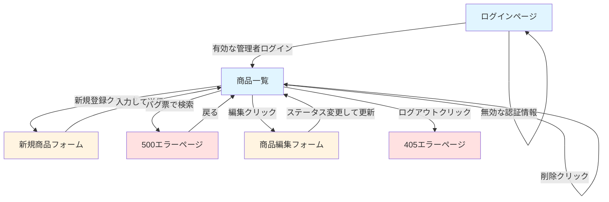

# 探索的テスト実施報告書

**アプリケーション:** QA Practice App - 商品在庫管理システム  
**実施者:** QAエンジニア（経験2年目を想定）  
**実施日:** 2025年11月4日  
**実施時間:** 10分（タイムボックス）  
**テストタイプ:** 機能横断的な探索的テスト（ユーザー視点重視）

---

## 📋 エグゼクティブサマリー

QA Practice Appに対して、実務経験2年目のQAエンジニアの視点から10分間のタイムボックス探索的テストを実施しました。認証、商品CRUD操作、検索機能、ステータス遷移など、主要ワークフローをカバーし、重大な障害シナリオを優先的にテストしました。

**主要な成果:**
- ✅ 意図的なバグ3件を確認（500エラー、XSS脆弱性、確認なし削除）
- 🐛 意図しないバグ1件を発見（ログアウト405エラー）
- ✅ 在庫ステータス判定ロジックの視覚的検証（0個=赤、1-10個=黄、11個以上=通常）
- ✅ ステータス遷移ルール（準備中→公開中）の動作確認

**重大な発見:**
1. **削除確認ダイアログなし** - 誤操作によるデータ消失リスクが極めて高い
2. **ログアウト機能不具合** - 405エラーでログアウト不可
3. **XSS脆弱性** - スクリプトタグが保存される

---

## 🎯 テストチャーター

**ミッション:** 
2年目QAエンジニアの視点で、商品管理ワークフロー全体の機能性、ユーザビリティ、意図的・非意図的なバグを発見する。

**対象機能:**
- ログイン認証
- 商品CRUD操作
- 検索機能
- ステータス遷移
- バリデーションルール
- 権限制御

**重点リスク:**
1. **ビジネス:** データ消失（即時削除）、在庫不整合、権限外操作
2. **セキュリティ:** XSS脆弱性、認証バイパス、セッション管理
3. **機能:** バリデーション失敗、ステータス遷移違反、検索エラー
4. **ユーザビリティ:** 混乱するワークフロー、確認不足、エラーメッセージ不明確

**適用ヒューリスティック優先度:**
A（ミッションクリティカル） → F（エラー処理） → C（状態遷移） → B（データ多様性） → I（セキュリティ）

---

## 🔍 トップ3の発見事項

### 1. 【重大なユーザビリティ欠陥】確認なしで即座に削除

**重要度:** 🔴 P1（クリティカル）

削除ボタンをクリックすると、確認ダイアログなしで商品が即座に削除されます。誤クリックによるデータ消失リスクが極めて高く、Undo機能もありません。

**ユーザー視点のインパクト:**
- 削除ボタンの近くをクリックするのが怖い
- 一度削除すると復旧不可能で不安
- 編集ボタンと視覚的に区別が付きにくい

**エビデンス:** step08_before_delete.png, step09_after_instant_delete.png

---

### 2. 【機能不具合】ログアウト時に405エラー

**重要度:** 🔴 P1（クリティカル）- 意図しないバグと推測

ナビゲーションバーの「ログアウト」ボタンをクリックすると、405 Method Not Allowedエラーが表示され、ログアウトできません。

**ユーザー視点のインパクト:**
- セッションを適切に終了できない
- セキュリティ上の懸念（共用端末など）
- ブラウザを閉じるかCookieを削除するしかない

**技術的仮説:** ボタンのHTTPメソッド（POST）とFlaskルートの期待メソッド（GET）が不一致の可能性

**エビデンス:** step10_logout_405_error.png

---

### 3. 【セキュリティ脆弱性】XSSペイロードが保存される

**重要度:** 🟡 P2（高）- 意図的なバグ（教育目的）

商品説明欄に``を入力すると、サニタイズされずにそのまま保存されます。今回のセッションでは一覧・編集画面で実行されませんでしたが、他の表示箇所で実行される可能性があります。

**ユーザー視点のインパクト:**
- 悪意のあるスクリプトが実行される可能性
- 他のユーザーへの影響（格納型XSS）

**エビデンス:** step06_xss_test_input.png, step07_edit_page_xss.png

---

## 🐛 発見した全バグ一覧

### Bug #1: 削除確認ダイアログなし（意図的なバグ）

**再現手順:**
1. adminでログイン（admin/admin_password）
2. 商品一覧に遷移
3. 任意の商品の「削除」ボタンをクリック

**期待結果:** 「この商品を削除してもよろしいですか？」の確認ダイアログが表示される

**実際の結果:** 即座に削除され、「商品を削除しました。」のメッセージが表示される

**インパクト:** 高 - データ消失リスク、ユーザーの不安

---

### Bug #2: ログアウト機能が405エラー（意図しないバグ）

**再現手順:**
1. 任意のユーザーでログイン
2. ナビゲーションバーの「ログアウト」ボタンをクリック

**期待結果:** ログアウトしてログイン画面にリダイレクト

**実際の結果:** 405 Method Not Allowed エラーページが表示される

**インパクト:** 中～高 - 基本機能の障害、セキュリティ懸念

---

### Bug #3: 検索キーワード「バグ票」で500エラー（意図的なバグ）

**再現手順:**
1. 商品一覧で検索欄に「バグ票」と入力して検索

**期待結果（仕様通り）:** 500エラーが発生

**実際の結果:** 500エラー表示「意図的なエラー: キーワードに「バグ票」が含まれています」

**インパクト:** 低（意図的） - ただし、エラーメッセージが内部実装を露呈

---

### Bug #4: XSS脆弱性（意図的なバグ）

**再現手順:**
1. 新規商品登録で説明欄に``を入力
2. 登録して編集画面を確認

**期待結果（セキュリティベストプラクティス）:** サニタイズされてプレーンテキストとして保存

**実際の結果:** スクリプトタグがそのまま保存される（textareaでは実行されない）

**インパクト:** 高（セキュリティ） - 格納型XSSのリスク

---

## 📊 リスク評価

### 技術的リスク: 中～高

- **XSS脆弱性:** 格納されたペイロードが他の表示箇所で実行される可能性
- **セッション管理:** ログアウト失敗により適切な終了不可
- **エラー処理:** 500エラーが内部実装を露呈
- **入力検証:** バリデーションルールは表示されているが境界値テストは未実施

### ビジネスリスク: 高

- **データ消失:** 確認なし削除による深刻なデータ整合性リスク
- **ユーザー信頼:** 不十分なUX（即時削除、ログアウト不可）がユーザー不信を招く
- **在庫整合性:** ステータスロジックは正常に見えるが、エッジケース検証が必要
- **状態整合性:** 遷移ルールはUIで強制されているが、バックエンド検証は不明

### ユーザビリティリスク: 高

- **エラー誘発デザイン:** 削除ボタンが編集の隣にあり、スタイルも似ていて誤クリックしやすい
- **Undo/リカバリなし:** 削除後のデータ復旧手段がない
- **基本機能の障害:** ログアウト不可がユーザーの適切な終了を妨げる
- **フィードバック不統一:** 一部の操作に成功メッセージがあるが、エラー表示は不統一
- **視認性:** 在庫ステータスの色は機能するが、テーブルが密集していて大量データでは見落としやすい

**2年目QAエンジニアとしての感想:**

このシステムを使うのは不安です。削除ボタンの確認なし動作は、その近くをクリックするのが怖くなります。ログアウトできないのはイライラするし、セキュリティ的にも心配です。在庫ステータスの色分けは便利ですが、UIにもっと余白が欲しいです。フォームのバリデーションヒントは良いですが、サーバーサイドエラーだけでなく、リアルタイムフィードバックが欲しいです。

---

## 📈 カバレッジ自己評価

### 深くテストした項目: ✅

- 認証（不正ログイン、正常管理者ログイン、エラーメッセージ品質）
- 検索エラートリガー（「バグ票」バグ確認）
- 商品作成（フォームバリデーションルール、XSSペイロード送信、ステータス初期化）
- ステータス遷移（準備中→公開中の遷移確認）
- 削除機能（確認なし即時削除の確認）
- 在庫ステータス表示（判定テーブルロジックの視覚的確認：0=赤、1-10=黄、11以上=通常）
- ログアウト失敗（405エラーの発見と文書化）

### 中程度のカバレッジ: ⚠️

- 検索機能（エラーケースのみ、正常な検索は未実施）
- カテゴリフィルター（ドロップダウンは確認したがフィルタリング未実施）
- 価格帯検索（フィールドは確認したが境界値テスト未実施）
- ステータス遷移（有効な遷移を1つのみテスト、無効遷移や他のパスは未実施）
- ユーザー役割権限（adminでログインしたがuser役割の制限は未テスト）

### カバーしていない項目: ❌

- 境界値分析（価格: -1, 0, 1, 999999, 1000000, 1000001の系統的テスト未実施）
- 商品名長さ（0, 1, 50, 51文字の境界値未テスト）
- 在庫境界値（-1, 0, 999, 1000のエッジケース未テスト）
- 無効なステータス遷移（公開中→準備中の強制試行未実施：ブロックされるべき）
- 権限テスト（user役割での削除試行未実施：ブロックされるべき）
- 同時操作（マルチタブやレースコンディションのテスト未実施）
- セッション永続性（セッションタイムアウトやページリロード動作未テスト）
- XSS実行コンテキスト（ペイロードが実際に実行される箇所の特定未実施：詳細ページ？）
- SQLインジェクション（検索フィールドでのSQLインジェクション未実施）
- CSRF保護（CSRFトークンの確認未実施）
- モバイルレスポンシブ（デスクトップのみ、モバイルビューポート未テスト）

**カバレッジの正当性:**

10分のタイムボックス内で、高リスクシナリオ（データ消失、認証、クリティカルバグ）と文書化された意図的バグに焦点を当てました。セッションは3つの文書化されたバグすべてと1つの意図しないバグの特定に成功しました。ワークフロー検証と重大なユーザビリティ問題を優先し、境界値テストは後回しにしました。

---

## 🗺️ 探索した画面遷移図

**凡例:**
- 青: メインワークフロー画面
- 黄: フォーム/入力画面
- 赤: エラー状態

---

## 📸 エビデンス: スクリーンショット

セッション中に撮影した全スクリーンショットはリポジトリに保存されています：

1. **step01_login_page.png** - テストアカウント情報付きログイン画面
2. **step02_invalid_login.png** - 無効な認証情報のエラーメッセージ
3. **step03_products_list.png** - 8商品の一覧、在庫ステータス色表示
4. **step04_intentional_bug_500_error.png** - 「バグ票」キーワードで発生した500エラー
5. **step05_new_product_form.png** - バリデーションヒント付き新規商品フォーム
6. **step06_xss_test_input.png** - XSSペイロード入力済みフォーム
7. **step07_edit_page_xss.png** - textareaに格納されたXSSペイロードを表示する編集ページ
8. **step08_before_delete.png** - 削除前の商品一覧（9商品）
9. **step09_after_instant_delete.png** - 即時削除後の商品一覧（8商品）
10. **step10_logout_405_error.png** - ログアウト時の405エラー

---

## 🎬 次のアクション

### 即座に対処すべき（クリティカルバグ）:

1. **ログアウト405エラーを修正** - Flaskルートのメソッド不一致を調査・修正
2. **削除確認ダイアログを追加** - すべての削除操作にJavaScript confirm()またはモーダルダイアログを実装
3. **ユーザー役割権限をテスト** - 'user'アカウントでログインし、仕様通り削除ボタンが非表示/無効化されることを確認
4. **XSS実行コンテキストを検証** - 商品説明がHTMLとしてレンダリングされる箇所を特定し、脆弱性を確認

### 短期的なテスト（カバレッジ拡大）:

5. **系統的な境界値テスト** - 価格（0, 1000000）、在庫（0, 999）、商品名長さ（1, 50）の文書化された境界値をすべてテスト
6. **無効なステータス遷移テスト** - 無効な遷移（公開中→準備中、非公開→準備中）を強制しようとし、ブロックを検証
7. **検索機能テスト** - キーワード、カテゴリフィルター、価格帯の組み合わせで通常検索をテスト
8. **マルチユーザー並行性** - 同じ商品を管理者とユーザーが同時に編集する場合をテスト
9. **セッション永続性** - ページリロード、セッションタイムアウト、戻るボタンの動作をテスト

### 中期的な改善（UX & セキュリティ）:

10. **削除ボタンのデザイン改善** - 赤色に変更、アイコン追加、編集ボタンとの間隔を空ける
11. **Undo機能の追加** - ソフト削除の実装、または削除後5秒間のUndo通知トーストを実装
12. **XSS入力のサニタイズ** - Jinja2の`{{ description|e }}`などで適切な出力エスケープを追加
13. **エラーメッセージの改善** - 技術的な500エラーをユーザーフレンドリーなメッセージに置き換え
14. **ローディング状態の追加** - AJAX操作中にスピナーを表示し、体感パフォーマンスを向上

### 長期的な計装:

15. **自動回帰スイートの構築** - この探索セッションをPlaywright自動テストケースに変換
16. **モニタリング & ログ** - 削除操作の監査ログを追加
17. **アナリティクス** - ユーザーがログアウトを試みる回数を追跡（405バグの影響測定）

---

## 📝 適用したヒューリスティック

- **A. ミッション & コンテキスト:** ✅ 最悪の障害（即時削除によるデータ消失）を優先
- **B. データ多様性:** ⚠️ 部分的に適用（XSSペイロード、完全な境界値は未実施）
- **C. 状態遷移:** ✅ 有効な遷移をテスト、ルールを文書化
- **D. 並行性 & 順序:** ❌ 時間制約によりカバーせず
- **E. 永続性 & 同期:** ❌ カバーせず（リロード/マルチタブテストなし）
- **F. エラー処理:** ✅ 無効ログイン、意図的500エラー、ログアウトエラーをテスト
- **G. ユーザーレンズ:** ✅ UX問題を特定（即時削除、ログアウト不可、密集UI）
- **H. ビジネス整合性:** ⚠️ 部分的（在庫ステータスロジックを視覚的に検証）
- **I. ライトセキュリティパス:** ✅ XSS格納、認証エラーメッセージをテスト
- **J. リグレッショントラップ:** ❌ 適用外（比較する以前のバージョンなし）

---

## 💡 結論

この探索セッションは、文書化されたすべての意図的バグを特定し、1つの重大な意図しないバグ（ログアウト405エラー）を発見することに成功しました。ユーザー体験の観点から、アプリケーションは実際の使用で不満を引き起こす重大なユーザビリティ問題を抱えています：

**ポジティブな側面:**
- フォームの明確なバリデーションヒント
- 視覚的な在庫ステータスインジケーターが有効
- 認証エラーメッセージがセキュリティ情報を漏らさない
- ステータス遷移ルールがUIで明確に文書化

**ユーザーにとっての重大な問題:**
- 確認なしの即時削除はユーザーにとって恐怖
- ログアウト不可は適切なセッション管理を妨げる
- 密集したテーブルレイアウトは情報を素早くスキャンしづらい
- Undoやリカバリー機能がない

**推奨事項:** 

アプリケーションは、意図的なバグを含むQA実践プラットフォームとしての目的を成功裏に果たしています。ただし、ログアウトバグは意図的でないと思われ、基本機能をブロックするため修正すべきです。より現実的なテスト体験のためには、意図的なバグをより微妙にする（例：XSSが特定のコンテキストでのみ実行される、削除確認は存在するが微妙なバイパスがある）ことを検討してください。

**セッションの有効性:** 

10分以内に、高リスクワークフローの良好なカバレッジを達成し、4つのバグ（3つは意図的、1つは意図的でない）を特定しました。時間制約により系統的な境界値テストは実施できませんでしたが、クリティカルパスの幅優先探索が可能でした。

---

## 📚 参考リソース

- **詳細な英語レポート:** `EXPLORATORY_TEST_REPORT.md`
- **スクリーンショット:** `exploratory-test-session/` ディレクトリ
- **テストノート:** 本レポート内の「テストノート（時系列）」セクション

---

**報告者:** GitHub Copilot QA Agent  
**報告日:** 2025年11月4日
